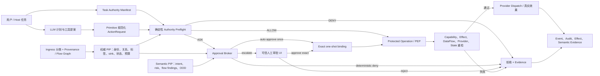

# 基于语义的自动权限审批与数据流识别：前期调研与落地建议

> 调研日期：2026-08-03<br>
> 仓库基线：`dd46f1d5ec439f3539605fd41c7b8938971f45a6`（调研时工作区存在其他未提交修改）<br>
> 适用对象：Agent libOS 的运行时、Capability、Human approval、Protected Operation、Object Memory、provider 与审计子系统<br>
> 文档性质：固定在上述 commit 的历史技术预研与立项建议，不构成当前产品、
> 接口、安全或发布契约，也不构成法律或合规意见。除“当前状态”说明外，本文中
> 的“当前”“已有”“缺口”“进入实现前”和行号链接都只指该历史基线。

> 当前状态（2026-08-11）：Agent libOS 1.5.1 已在默认关闭的前提下实现
> Phase 0–4，包括 payload-free FlowGraph、闭集确定性拒绝，以及静态 Host
> epoch 下的低风险 exact-once canary。本文的路线表和 backlog 是基线时的历史
> 提案，不能用来判断这些阶段今天是否已实现。
> 当前能力、配置、存储迁移、隐私边界与明确未实现项以
> [Semantic Approval and Data Identification](semantic_shadow.md) 为准。本文中
> 关于 Phase 5、长期记忆、Cedar/OPA、高风险自动权限或自动生产放量的描述仍是
> 后续提案，不能理解为当前运行时能力。

## 0. 结论先行

本项目值得做，但“基于语义的自动审批”和“基于语义的数据流识别”不能被实现为一个拥有最终权限的 LLM 审查器。推荐的产品定义是：

1. **语义层负责理解和举证**：从用户任务、工具调用、数据内容、上下文和历史中抽取意图、目的、目标、风险、敏感类别、数据依赖及异常信号。
2. **确定性运行时负责裁决和执行**：Capability、Task Authority、provider policy、数据流策略、一次性授权、状态版本和预算共同构成不可被语义模型突破的硬边界。
3. **自动审批是硬边界内的窄授权**：只为 Host 预先声明为 `auto_approvable` 的低风险动作签发精确、一次性、短时、不可委托的执行绑定；不是把原本要求人工的任意动作交给模型决定。
4. **语义数据流识别是保守标签的补充**：DLP、schema、连接器元数据和语义模型共同发现敏感内容与依赖；动态 IFC/reference monitor 仍在真实 sink 前执行。模型可提高敏感度或降低可信度，不能自行去标签、提升完整性或批准 declassification。
5. **同时建模机密性与完整性**：秘密是否外泄只是半个问题；网页、邮件、工具结果或旧记忆是否控制了高权限动作，是间接 prompt injection、confused deputy 和 memory poisoning 的共同结构。
6. **先 shadow、再确定性 deny + 语义 escalate、最后低风险 auto-allow**：critical/high-impact action 结构性排除在自动批准之外；对 eligible 低风险动作分别报告 unsafe auto-approval share、unsafe-request miss、分层置信区间和自动化覆盖率，而不是只报告总体准确率。

对 Agent libOS 而言，这不是从零建设。现有代码已经具备较强的执行底座：Capability 决策和一次性消耗、Task Authority 衰减、人工审批事务、Protected Operation 的 preflight/revalidation、稳定 sink 身份、数据标签与来源快照、精确一次性 release、事件与审计。最合理的路线是在这些硬边界前增加一个**受约束的语义证据层**，而不是另建一套平行授权系统。

建议立项的北极星指标是：

> 在不增加任何硬权限、不降低现有数据标签、不牺牲关键安全不变量的前提下，减少低风险重复人工审批，并提高对跨工具、跨记忆、跨数据变换的敏感流和低完整性控制流的发现率。

## 1. 研究问题、术语与边界

### 1.1 两个目标必须拆开定义

**语义自动权限审批**回答的是：

> 对一个已规范化、可精确执行的动作，本次请求是否符合用户当前任务、组织政策、资源范围、风险容忍度和历史偏好，从而可以在既有权限上限内自动执行？

它不是身份认证，也不是凭空授予权限。传统授权仍然回答“主体是否有权对资源做动作”；语义审批补充回答“这次动作是否符合本次任务的目的、上下文和风险”。

**语义数据流识别**回答的是：

> 哪些输入数据或控制条件影响了哪些模型输出、工具参数、外部效果、日志、缓存和记忆，以及这些流是否跨越了机密性、完整性、租户、目的或接收方边界？

它不等于 DLP 扫描，也不等于 lineage 可视化。DLP 主要识别“像什么数据”，lineage 记录“从哪里来、如何派生”，IFC 才负责“是否允许到达这个 sink”。

### 1.2 需要明确区分的四类决策

| 决策 | 示例 | 谁可以提出 | 谁必须最终执行 |
|---|---|---|---|
| 身份与基础授权 | Alice 是否能读项目 A | IAM、Capability、Task Authority | 确定性授权引擎和资源端 |
| 语义意图与风险 | 这次读取是否为修复当前 bug 所需 | 语义模型、规则、上下文分类器 | 作为策略输入；不能单独放权 |
| 信息流决策 | 受限数据能否发往某个 sink | 标签器、provenance、IFC policy | 运行时 reference monitor |
| 降级与背书 | 是否可脱敏后外发；低可信邮箱是否被验证 | Host 定义的 transform、用户或管理员 | 精确 declassification/endorsement 权限 |

### 1.3 本报告的安全假设

- 模型、用户输入、网页、邮件、RAG、工具描述、工具输出和长期记忆均可能恶意或错误。
- Host 配置、Capability/DataFlow manager、Protected Operation SDK、可信存储及其直接管理员属于 TCB；若 TCB 或数据库管理员被攻破，运行时证据不能宣称防篡改。
- 只有经 Agent libOS primitive/provider/SDK 中介的效果能被完整执行控制。native 进程的任意系统调用、旁路网络和外部 SaaS 接收后的二次使用，需要 OS sandbox、独立凭据和 egress proxy 等额外边界。
- 自动审批优化的是低风险动作的交互成本，不应被用来消除高后果动作的人类责任。

### 1.4 调研方法与证据分级

本报告结合四类证据：

- **A 级：标准与规范**——NIST、W3C、OWASP 正式文档及授权/数据流规范；用于定义边界和术语。
- **B 级：同行评审研究**——Zanzibar、AgentDojo、ToolEmu、Task Shield、经典 IFC/taint/provenance 与权限 UX 研究；用于判断已验证的机制和权衡。
- **C 级：前沿预印本/研究发布**——CaMeL、FIDES、AutoCedar、Prose2Policy、2026 agent permission 综述；用于发现方向，不能当作生产保证。
- **D 级：仓库证据**——直接检查基线 commit 的代码、文档、invariants、tests 和当时的 benchmark 报告；用于提出 Agent libOS 的接入点与缺口。

本轮是前期调研，没有修改运行时代码，也没有为新方案执行真实模型或生产流量实验。报告中的建议门槛需要后续 shadow 数据和受控红队验证。

## 2. 调研基线中的 Agent libOS 底座与差距

### 2.1 基线已有能力

| 子系统 | 当前能力 | 对本项目的价值 |
|---|---|---|
| Capability | `authorize` 返回结构化决定，`require` 消耗有限次授权；真实优先级为 `DENY > 匹配当前 operation 的 exact one-shot approval > ASK > ALLOW > MISSING`；支持约束、委托衰减和一次性 reservation。参见 [`CapabilityManager`](https://github.com/yingqi-z20/Agent-libOS/blob/dd46f1d5ec439f3539605fd41c7b8938971f45a6/agent_libos/capability/manager.py#L127)、[`authorize`](https://github.com/yingqi-z20/Agent-libOS/blob/dd46f1d5ec439f3539605fd41c7b8938971f45a6/agent_libos/capability/manager.py#L706)、[`require`](https://github.com/yingqi-z20/Agent-libOS/blob/dd46f1d5ec439f3539605fd41c7b8938971f45a6/agent_libos/capability/manager.py#L805)。 | 可作为最终 PDP/PEP 与自动审批 token 的消费点；one-shot 只能消解匹配的 ASK，不能覆盖 DENY，也无需让模型直接操作权限存储。 |
| Permission policy / Human | 已有 `always_allow`、`always_deny`、`ask_each_time`、`allow_once`，模型权限请求受 Task Authority ceiling 和请求形状限制；人工批准可产生精确授权。参见 [`request_permission`](https://github.com/yingqi-z20/Agent-libOS/blob/dd46f1d5ec439f3539605fd41c7b8938971f45a6/agent_libos/human/manager.py#L573) 与 [capabilities 文档](capabilities.md#permission-policy-and-human-approval)。 | 可复用其队列、并发单决策和原子 grant 模式，但机器决定必须用专用 API/event，不能伪装成现有 `human.response`。 |
| Task Authority | Host 在任务启动时声明 capability、effect、requestable ceiling、预算和数据接收域，子任务只能取交集或继续衰减。参见 [Task Authority Manifest](task_authority_manifest.md)。 | 可新增“哪些请求允许语义自动处理”的显式上限；默认不允许语义层扩大 authority。 |
| Protected Operation | 用 durable、分阶段事务化状态机连接 capability reservation、effect ceiling、规范参数、状态/DataFlow 重检、dispatch intent、provider 调用、结算与证据。Provider I/O 发生在数据库事务外，模糊结果记录为 `unknown`。参见 [`ProtectedOperationContract`](https://github.com/yingqi-z20/Agent-libOS/blob/dd46f1d5ec439f3539605fd41c7b8938971f45a6/agent_libos/sdk/protected_operations.py#L140)、[`_preflight_data_flow`](https://github.com/yingqi-z20/Agent-libOS/blob/dd46f1d5ec439f3539605fd41c7b8938971f45a6/agent_libos/sdk/protected_operations.py#L1392)、[`_revalidate_data_flow`](https://github.com/yingqi-z20/Agent-libOS/blob/dd46f1d5ec439f3539605fd41c7b8938971f45a6/agent_libos/sdk/protected_operations.py#L1553)。 | 是一次性授权在真正副作用前重验、预留并保真记录外部不确定性的最佳执行点。 |
| 数据标签 | 已有 sensitivity、trust、integrity、tenant/principal/declassification authority；聚合采用最高敏感度、最低可信度/完整性和冲突身份 fail-closed。参见 [`DataLabels`](https://github.com/yingqi-z20/Agent-libOS/blob/dd46f1d5ec439f3539605fd41c7b8938971f45a6/agent_libos/models/data_flow.py#L75) 与 [`aggregate`](https://github.com/yingqi-z20/Agent-libOS/blob/dd46f1d5ec439f3539605fd41c7b8938971f45a6/agent_libos/models/data_flow.py#L151)。 | 已经具备 IFC 的基础 lattice，可扩展类别、用途和语义证据而不推倒重来。 |
| 来源与 sink | `DataFlowContext` 持有精确 Object version/hash 来源；sink 由 Host registry 解析为稳定身份；egress 在 provider 前检查并在执行前重检。参见 [`DataFlowContext`](https://github.com/yingqi-z20/Agent-libOS/blob/dd46f1d5ec439f3539605fd41c7b8938971f45a6/agent_libos/models/data_flow.py#L206)、[`DataSink`](https://github.com/yingqi-z20/Agent-libOS/blob/dd46f1d5ec439f3539605fd41c7b8938971f45a6/agent_libos/models/data_flow.py#L257)、[`authorize_egress`](https://github.com/yingqi-z20/Agent-libOS/blob/dd46f1d5ec439f3539605fd41c7b8938971f45a6/agent_libos/runtime/data_flow_manager.py#L461)。 | 能把语义分类与真实数据对象、目标、registry generation 和 payload digest 绑定。 |
| 精确 release | 只有 `conditional` sink 接收高于 `normal` 的数据时，才可通过单独、一次性、与来源版本、manifest、目标状态和 payload 绑定的 release authority 放行；`untrusted` sink 不能靠人工 release 升级，`trusted` sink 在 clearance 内无需 release。参见 [data flow 文档](data_flow.md#exact-conditional-release)。 | 应复用其精确 binding，但严禁语义模型把“已脱敏/可以分享”当作 release 权限或把 untrusted sink 变 trusted。 |
| Evidence | Capability/DataFlow/effect 等安全路径已有结构化事件与审计，部分记录采用 payload-free hash/metadata；但证据底座并不统一：Human request/decision、process message 可持久化完整内容，Human request 行可更新，Event/Audit 又是自由字典。 | 新 semantic assessment 必须使用独立 typed、append-only、payload-minimized record，不能假设现有所有证据都已统一脱敏或受同一 retention 管理。 |

### 2.2 现有设计中必须保持的不变量

1. 工具可见性不是权限；actor 名称也不是授权凭据。
2. 任何模型、Skill、JIT 或 provider 内容都不能调用 Host-only `issue_trusted` 或绕过 authority。
3. 人工/机器决定与其签发的一次使用 Capability 在各自事务内原子提交；原操作重试后才创建执行 reservation。Protected Operation 的 prepare/dispatch/settle 各阶段内部原子，外部 provider I/O 不宣称跨系统原子，模糊结果必须记录 `unknown`。
4. sink 身份、provider spec、registry generation、目标状态和来源版本改变后必须重授权。
5. 数据 release 是独立权限；普通文件写权限或人工批准不能顺带信任外部 sink。
6. 未知、缺失、冲突和解析失败的约束、标签或来源必须 fail closed。
7. 模型只可做保守标注，不能提高 trust/integrity、降低 sensitivity、移除 tenant/principal 或赋予 declassification authority。
8. 审批 UI 必须由可信运行时从实际 canonical action 生成，不能只展示模型写的摘要。

### 2.3 基线主要缺口

本节是 `dd46f1d…` 的缺口快照，并不维护逐项解决状态。Phase 0–4 的当前
能力和明确未实现项只以 [Semantic Approval and Data Identification](semantic_shadow.md)
为准。

当前底座能强制执行“已知的权限和标签”，但尚不能充分回答“动作为什么符合当前任务”及“内容中的哪些字段、条件和记忆影响了动作”。需要补齐：

- **语义意图契约**：没有统一的 task goal、purpose、beneficiary、expected effects、reversibility、recipient 和 evidence reference 表达。
- **上下文风险分类**：没有把歧义、异常范围、工具新颖度、目标变化、prompt injection、历史偏离和控制流 taint 变成稳定的策略输入。
- **内容级分类**：当前标签主要来自 Host/Object/connector 边界，缺少 PII、凭证、源代码、合同、财务、健康等字段或 chunk 级语义识别。
- **显式数据依赖图**：有保守高水位和来源快照，但缺少字段级 direct/indirect edge、transform、sanitizer、declassifier、endorser 记录。
- **隐式/控制流**：秘密或低可信输入可以通过工具选择、调用次数、收件人选择、异常、重试或记忆命中影响可观察效果；仅跟踪 payload 复制无法覆盖。
- **目标长期记忆治理**：若未来引入跨会话 durable memory，其写入是未来会话的持久 sink，读出又是 source，需要写入背书、检索完整性和沿 provenance 的撤回/失效。当前 Object Memory 的普通 payload 主要在运行时内存中，SQL 仅存 marker；重启后相关对象会释放，只有 metadata/provenance 等持久化，不能把它描述成已经存在的跨会话长期 payload store。参见 [Object Memory 文档](object_memory.md) 与 [`sql.py`](https://github.com/yingqi-z20/Agent-libOS/blob/dd46f1d5ec439f3539605fd41c7b8938971f45a6/agent_libos/storage/sql.py#L4052)。
- **模型生命周期治理**：分类器版本、prompt、schema、校准集、OOD 和漂移尚未成为授权证据的一部分。
- **评测覆盖**：基线 runtime-safety suite 有 32 个确定性任务；当前 suite 有
  33 个。两者都不能单独证明语义审批的 calibration、跨工具字段 lineage、
  间接流和长期记忆安全。

### 2.4 基线代码级差距清单

以下项目不是对现有文档保证的否定，而是当前保证边界内、语义化建设需要优先处理的具体缺口：

| 优先级 | 当前行为/缺口 | 影响与建议 |
|---|---|---|
| P0 | [`unclassified_ingress_context()`](https://github.com/yingqi-z20/Agent-libOS/blob/dd46f1d5ec439f3539605fd41c7b8938971f45a6/agent_libos/runtime/data_flow_manager.py#L957) 对未知外部输入采用 `normal / untrusted / untrusted`。 | 完整性较保守，但机密性可能低标：外部响应实际可含凭据、PII 或商业机密。应先创建精确 `ExternalSourceRef`，分类后由 runtime 签发 `DataFlowContext`；分类失败采用组织批准的保守上限或强制 ASK，不能把未识别等同于普通数据。 |
| P0 | 原始 root goal 没有内容分类，无显式来源时使用默认 `normal / unknown / local` 元数据。参见 [`process_manager.py`](https://github.com/yingqi-z20/Agent-libOS/blob/dd46f1d5ec439f3539605fd41c7b8938971f45a6/agent_libos/runtime/process_manager.py#L2878)。 | 用户任务本身可能含秘密、第三方粘贴内容或低可信指令。应按 message segment 保留 source/integrity，而不是整段统一信任。 |
| P0 | ingress 主要提升 ambient context，当前持久化 decision 以 egress 为中心。 | 应新增 ingress classification/assessment ledger，记录 source、detector、版本、标签下界、冲突和 evidence digest；否则无法重放标签为何出现。 |
| P0 | 现有 Host `auto_approve` 是粗粒度运行时开关；对 permission request 可映射成持久 `always_allow`，其他请求做布尔批准。参见 [`_select_permission_policy`](https://github.com/yingqi-z20/Agent-libOS/blob/dd46f1d5ec439f3539605fd41c7b8938971f45a6/agent_libos/human/manager.py#L2629)。 | 适合测试/受控 Host 脚本，不应作为生产语义审批。新路径必须有独立 actor、三态结果、exact one-shot 和 policy/model provenance。 |
| P1 | 对象/ambient flow 是保守 high-water，缺字段、JSONPath、CSV 列和 span 级 lineage。 | 安全兜底应保留；在其上增加字段级 findings/edges，以降低 over-taint，但字段分析失败时退回整体标签。 |
| P1 | 没有专门的 `pc_label`；工具选择、是否调用、次数、异常、文件名、收件人、长度和时间等控制依赖未被完整建模。 | 增加 strict mode 与 `CONTROL` edge；高保障 action 采用固定次数/预算或人工确认。 |
| P1 | JSON-RPC、MCP、LLM、Shell 等响应多为粗粒度 origin 标签，缺少统一、可版本化的 provider-response source ref。 | 为每次外部响应创建 digest、provider spec/generation、call/effect ID 绑定的 source entity，便于跨工具追踪和撤回。 |
| P1 | 当前 `trust_level` 主要传播；sink clearance 的关键检查集中在 integrity、sensitivity、identity domain 和 sink 配置。参见 [`_clearance_error`](https://github.com/yingqi-z20/Agent-libOS/blob/dd46f1d5ec439f3539605fd41c7b8938971f45a6/agent_libos/runtime/data_flow_manager.py#L1430)。 | 明确 `trust` 与 `integrity` 的策略语义，避免同名/近义字段只被记录却不执行；新增测试证明每个安全标签都被某个 policy 消费。 |
| P1 | declassification 主要依赖对象级 admin capability，缺少 sanitizer/输出 hash/字段/目的/理由的变换证明。 | 建立 `TransformRegistry`，把 transform artifact、输入输出 digest、字段范围、sink、purpose 和 one-shot release 一起绑定。 |
| P1 | Event/Audit payload 是自由字典，生产者自行负责标签与脱敏；部分 Shell evidence 可保存完整 argv。 | 语义分类会增加敏感信息面。应在 evidence schema 层集中执行 label、safe projection、size bound 和 retention，而非依赖字段名正则。 |
| P1 | Human request/decision 与普通 process message 可保存完整 payload/body；Human request 状态是可更新记录，年龄型 payload retention 又主要覆盖 LLM Call/ExternalEffect。参见 [`sql.py`](https://github.com/yingqi-z20/Agent-libOS/blob/dd46f1d5ec439f3539605fd41c7b8938971f45a6/agent_libos/storage/sql.py#L14678)、[process message 存储](https://github.com/yingqi-z20/Agent-libOS/blob/dd46f1d5ec439f3539605fd41c7b8938971f45a6/agent_libos/storage/sql.py#L16026) 与 [`payload_retention.py`](https://github.com/yingqi-z20/Agent-libOS/blob/dd46f1d5ec439f3539605fd41c7b8938971f45a6/agent_libos/evidence/payload_retention.py#L68)。 | 不要把所有“审计/证据”笼统称为 append-only、payload-free。新增 semantic record 独立建 typed repository，并为各现有表做数据盘点、最小化与删除测试。 |
| P1 | LLM 记录可保存完整 prompt、tool schema、response/reasoning/raw response，配置默认 `persist_full_io=True`；年龄 retention 默认关闭或覆盖面有限。参见 [`records.py`](https://github.com/yingqi-z20/Agent-libOS/blob/dd46f1d5ec439f3539605fd41c7b8938971f45a6/agent_libos/llm/records.py#L21)、[`defaults.py`](https://github.com/yingqi-z20/Agent-libOS/blob/dd46f1d5ec439f3539605fd41c7b8938971f45a6/agent_libos/config/defaults.py#L550) 和 [`payload_retention_enabled`](https://github.com/yingqi-z20/Agent-libOS/blob/dd46f1d5ec439f3539605fd41c7b8938971f45a6/agent_libos/config/defaults.py#L268)。 | 语义服务上线前必须做数据盘点、purpose/retention 配置、敏感 payload 分离、purge/legal-hold 测试；不能为审批可解释性无限保留原始上下文。 |
| P1 | Shell/native 子进程后续文件与网络 I/O 不在 runtime 的完整中介范围；文件 sidecar 也可能无法反映任意外部修改。 | 对需要保证的 action 使用窄 provider、sandbox、文件/网络代理和独立凭据；报告中明确 end-to-end 保证仅覆盖受中介效果。 |

现有 `DataSourceRef(oid, version, content_sha256)`、file binding、stable sink 和 dispatch 前 revalidation 已为这些改造提供了正确的身份与 TOCTOU 基础，不需要用语义模型替代它们。

## 3. 权限与策略技术路线调研

### 3.1 从 RBAC 到 Capability、ABAC、ReBAC 与 RAdAC

| 模型 | 擅长解决 | 不足 | 本项目中的位置 |
|---|---|---|---|
| RBAC | 稳定组织角色和职责分离 | 难表达任务、对象、目的、风险和瞬时上下文 | 作为主体属性来源，不作为语义审批主体 |
| ABAC | 基于 subject、object、action、environment 属性做细粒度决策 | 属性真实性、schema 与策略复杂度是关键；不会自动理解自然语言 | 目标决策 schema 的基本形态。NIST SP 800-162 给出标准定义，SP 800-205 强调属性准备、真实性、安全、就绪与管理。[NIST SP 800-162](https://csrc.nist.gov/pubs/sp/800/162/upd2/final)、[NIST SP 800-205](https://csrc.nist.gov/pubs/sp/800/205/final) |
| ReBAC | 组织成员、资源所有权、共享和代理关系 | 不能单独表达动作目的、数据敏感度和流向 | 需要跨企业对象图时补充；Zanzibar 是大规模代表。[Google Zanzibar](https://research.google/pubs/zanzibar-googles-consistent-global-authorization-system/) |
| RAdAC | 将任务需要、会话与环境风险纳入动态授权 | 若风险计算不透明，会变成不可审计的黑箱评分；风险事实也可能陈旧或被操纵 | 可借鉴“风险改变路由”，但硬禁区优先于概率分数；NIST IR 7657 也不支持把它理解为无需用户判断的严格全自动系统。[NIST RAdAC](https://csrc.nist.gov/glossary/term/Risk_Adaptive_Adaptable_Access_Control)、[NIST IR 7657](https://csrc.nist.gov/pubs/ir/7657/final) |
| Capability | 持有即授权、易做精确委托、衰减、一次性和不可伪造绑定 | 需要严谨的发行、撤销和资源命名；不自动表达语义 | Agent libOS 的最终 authority 载体，继续保留 |
| IFC/DIFC | 约束信息从 source 到 sink 的允许方向 | 依赖正确标签和可信降级点；不替代动作授权 | 与 Capability 正交，负责“数据能去哪里” |

结论不是选一个模型，而是组合：**Capability 负责执行权；Task Authority 负责任务上限；typed ABAC/RAdAC context 负责确定性策略；ReBAC 提供关系事实；语义模型只产生属性与风险证据；IFC 负责数据流。**

### 3.2 PDP、PIP 与 PEP 的正确分工

NIST Zero Trust 将 Policy Engine、Policy Administrator 和 Policy Enforcement Point 分离，并强调不因网络位置或所有权给予隐式信任。[NIST SP 800-207](https://csrc.nist.gov/pubs/sp/800/207/final) 在本项目中可映射为：

- **PIP（Policy Information Point）**：身份、租户、Task Authority、Capability、对象标签、sink registry、工具 schema、semantic intent/risk/flow assessments。
- **PDP（Policy Decision Point）**：本地、确定性、类型化的 policy evaluator；输出 `ALLOW / DENY / REQUIRE_HUMAN` 与 obligations。
- **PA（Policy Administrator）**：将决定变成一次性 capability/reservation 或 Human request；不能把长期宽权限返回给模型。
- **PEP（Policy Enforcement Point）**：primitive、Protected Operation SDK、provider adapter 和资源端；在执行前重检。

语义模型只能是 PIP。让它同时成为 PDP 和 PEP，会把 prompt injection、随机输出和模型升级直接变成权限变化。

### 3.3 OPA、Cedar 与 Zanzibar/OpenFGA 类系统

| 方案 | 优点 | 风险/代价 | 推荐结论 |
|---|---|---|---|
| Agent libOS 原生 typed policy | 最容易与 capability grant/reservation、Task Authority、state version、DataFlow 和现有分阶段事务状态机一致集成；TCB 小 | 需要自建 authoring/analysis 工具，生态较小 | **第一阶段首选执行内核** |
| Cedar | PARC（principal/action/resource/context）请求清晰；默认拒绝，forbid 覆盖 permit；schema validation 和可分析性较强。[Cedar authorization](https://docs.cedarpolicy.com/auth/authorization.html)、[validation](https://docs.cedarpolicy.com/policies/validation.html) | 仍由应用保证请求和实体事实真实；需处理与现有 Capability 原子事务的适配 | **首选政策表达/验证参考**；可先做离线 lint/analysis，再评估嵌入式 evaluator |
| OPA/Rego | 接受任意结构化 JSON、通用表达力强；policy/decision 解耦；有 bundle、签名与 decision log 生态。[OPA](https://www.openpolicyagent.org/docs)、[Rego](https://www.openpolicyagent.org/docs/policy-language) | 语言和输入面更宽；远程 sidecar 会增加可用性、版本一致性和 TOCTOU 耦合；decision log 可能含敏感输入，需 masking。[OPA decision logs](https://www.openpolicyagent.org/docs/management-decision-logs) | 企业已有 OPA 控制面时可接入；不建议首版把每个 one-shot 授权依赖远程 OPA |
| Zanzibar/OpenFGA 类 | 大规模关系图、外部一致性和低延迟查询能力强 | 解决“谁与资源有何关系”，不解决自然语言意图、风险、payload 数据流与 declassification | 只有出现大规模跨产品 ReBAC 需求时采用 |

建议采用“双层政策”而非二选一：Agent libOS 内部保留安全关键、事务化的最小 typed evaluator；组织级业务政策可由 Cedar/OPA 编译或投影为受版本控制的 policy bundle，但任何外部 PDP 结果都只能在 Task Authority 与 Capability 上限内继续缩小权限。

### 3.4 自然语言政策与语义审批的研究状态

研究已经证明 LLM 能显著降低政策编写成本，但尚未证明可以绕过形式化边界直接授权：

- 2026 年的 AutoCedar 先把自然语言变为可审阅、可检查的 intent atoms，再在固定语义边界内生成并验证 Cedar；其价值恰恰在于**模型不能修改已经审阅的目标**。[AutoCedar](https://arxiv.org/abs/2607.03656)
- Apple 的 Prose2Policy 将自然语言转换为 Rego，并串联检测、结构抽取、schema validation、lint、compile 和自动测试；论文报告的 compile/test 指标说明 pipeline 有用，也说明“可编译”与“符合真实意图”是不同门槛。[Prose2Policy](https://machinelearning.apple.com/research/prose2policy)
- Task Shield 在运行时检查工具调用是否服务于用户任务，表明 task alignment 是很有价值的风险信号；它仍不等于资源授权、数据 release 或事实真实性。[Task Shield](https://aclanthology.org/2025.acl-long.1435/)
- 移动端上下文权限研究曾用“自动允许、自动拒绝、不确定时询问”降低提示负担，并报告 96.8% 用户偏好预测准确率；但移动权限上下文没有 Agent 面临的恶意 prompt、宽服务账户和跨工具组合攻击，不能直接外推为安全保证。[Dynamic Permissions](https://arxiv.org/abs/1703.02090)
- 2026 年对 21 个 agent permission 提案和 5 个商业系统的综述指出，低用户负担、形式化规范与确定性执行仍难同时满足；该文为最新预印本，应作为研究观察而不是生产事实。[How Agents Ask for Permission](https://arxiv.org/abs/2607.13718)

因此推荐把自然语言用于两个离线或受限环节：

1. **政策创作**：NL → typed intent atoms → 人审 → executable policy → schema/negative tests/verification。
2. **运行时证据**：request/context → typed semantic assessment；其结果必须由已审阅 policy 消费，不能生成新 policy 或新 authority。

## 4. 数据流识别技术路线调研

### 4.1 四层组合，而非单一检测器

| 技术 | 回答的问题 | 优势 | 主要盲点 | 推荐角色 |
|---|---|---|---|---|
| DLP / 内容分类 | 内容看起来是否包含 PII、凭证、支付、合同等 | 适合入口发现和 sink 二次扫描 | 编码、推断、聚合和上下文秘密会漏；存在误报 | 增加敏感标签，未命中不能证明 Public |
| 静态污点 | 某 source 是否可能到达某 sink | 能覆盖尚未执行路径，适合 CI | 动态代码、未知库和工具行为模型不完整 | 检查 adapter、sanitizer、sink coverage |
| 动态 taint / IFC | 本次真实执行的流是否允许 | 看到实际参数、对象版本和收件人，可阻断 | 只覆盖已执行路径；隐式流和 over-taint 难平衡 | 运行时强制执行核心 |
| Provenance / lineage | 数据从何而来、经何变换 | 审计、影响面、重放、撤回传播 | 描述事实，本身不阻断 | 形成可验证 flow graph 与证据 |

Google Sensitive Data Protection 使用模式、校验和、机器学习与上下文等检测手段，但其文档明确提醒内置 detector 并非完全准确、不能保证合规。[Google Sensitive Data Protection](https://docs.cloud.google.com/sensitive-data-protection/docs/concepts-de-identification) 因而融合规则必须是：**命中可以提高 sensitivity；未命中不能自动降低 sensitivity。**

### 4.2 同时跟踪 confidentiality 与 integrity

建议把 flow policy 视为两个相互独立的 lattice：

- **Confidentiality / sensitivity**：数据能否被某主体、租户、provider、收件人或 sink 看到。
- **Integrity / trust**：数据是否足够可信，能够影响某个高权限动作、长期记忆、安全设置或外部承诺。

示例：

| 数据 | 机密性 | 完整性 | 主要风险 |
|---|---|---|---|
| Secret manager 返回值 | secret | verified/trusted | 外泄 |
| 公开网页 | public | untrusted | prompt injection、虚假参数 |
| 用户当前任务 | 依内容决定 | user_asserted | 仍受组织政策限制 |
| 用户粘贴的网页正文 | 依内容决定 | untrusted | 不能因处于 user message 而整体升级 |
| 经过 schema validation 的 JSON | 原标签不变 | 最多 checked | schema 只证明形状，不证明事实或授权 |

间接 prompt injection 首先是“低完整性 source → 高权限控制/参数 sink”；如果它再带出秘密，才同时成为机密性泄露。只做 outbound DLP 会漏掉攻击链的前半段。

### 4.3 LLM 是不透明变换，默认必须保守聚合

传统 IFC 的安全规则可写为：

```text
labels(output) = join(labels(all_materialized_inputs), pc_label)
```

其中 `pc_label` 表示控制当前分支、循环、异常或工具选择的数据标签。对 LLM，不能可靠地从注意力、模型解释或另一模型的判断证明“某段输入完全没有影响输出”。因此：

- 默认情况下，模型输出继承本次实际 materialized context 的保守高水位和精确来源集合。
- 字段级 semantic dependency 可以用于解释、检索优化和减少误报，但**不能单独从输出中移除高敏或低完整性标签**。
- 只有 Host 注册、版本固定、具有前后条件和专项测试的 sanitizer/declassifier/endorser 可以改变安全标签。
- 模型总结、翻译、JSON 格式化、编码、加密或“我没有包含秘密”的自述都不是自动去标签依据。

CaMeL 通过从可信用户请求中显式提取控制流和数据流、用 capability 约束工具来隔离不可信数据；Microsoft 的 FIDES 工作则形式化讨论了 Agent planner 的 IFC 与表达能力权衡。二者支持“可信控制与不可信数据分离”的方向，也都不能消除标签正确性、记忆污染、旁路 I/O 和所有隐蔽信道。[CaMeL](https://arxiv.org/abs/2503.18813)、[Microsoft Research: FIDES](https://www.microsoft.com/en-us/research/publication/securing-ai-agents-with-information-flow-control/)

### 4.4 显式流、间接流与隐蔽信道

需要记录的不只是“字符串 A 被复制到参数 B”：

- `DIRECT/IDENTITY`：原值直接进入输出。
- `DIRECT/TRANSFORMATION`：值经总结、解析、计算、遮盖或聚合后进入输出。
- `INDIRECT/CONDITIONAL`：输入决定是否调用、调用什么或选择哪个收件人。
- `INDIRECT/FILTER/JOIN/SORT/GROUP`：输入不出现在输出值中，但改变结果集合或顺序。
- `CONTROL`：输入影响计划、重试、异常、终止、工具次数或长期记忆写入。

OpenLineage 的 column lineage 已区分 `DIRECT` 与 `INDIRECT`，并包含 `FILTER`、`JOIN`、`CONDITIONAL` 等 subtype，可借鉴为内部 edge vocabulary；但 OpenLineage 面向 job/dataset 观测，不应直接承担 Agent 的安全执行。[OpenLineage column lineage](https://openlineage.io/docs/spec/facets/dataset-facets/column_lineage_facet/)

高保障模式应维护 `pc_label`，使依赖敏感或低完整性条件的有状态工具调用、外发和记忆写入继承该条件标签。仍应在威胁模型中明确不完全覆盖的 timing、长度、调用次数和资源消耗信道；必要时增加固定次数、padding、速率限制或泄露预算。

### 4.5 短期上下文与长期记忆

**短期上下文**不应压平成来源不可区分的单一 prompt。建议至少保留：可信 task intent、Host policy、低可信工具数据、秘密对象、模型中间值和已验证事实等 typed cells。规划模型可以看受控视图，解析不可信文档的 quarantined model 不持有工具权限；最终工具网关仍须检查真实参数和 flow，因为双模型隔离不能阻止低可信内容改变收件人、路径或数值。

**长期记忆**必须同时视为 sink 与未来 source：

- 写入需要单独 authority、来源、tenant、purpose、TTL、版本和完整性标签。
- 低可信观察不能自动晋升为用户偏好、身份事实、安全规则或工具说明。
- summary、embedding、索引键和检索结果仍是原记录的派生物；不能因变成向量而去标签。
- 记忆检索选择本身可能泄露敏感索引或让低完整性记录控制动作。
- 删除、同意撤回或 source 失效后，应沿 provenance 使后代、缓存和 embedding 失效，而不只删除原文。

这是目标架构要求，不是当前 Object Memory 的持久性描述。当前普通 Object payload 存在进程内缓存，SQL 保存 `runtime_memory` marker；重启后相关对象会释放，而 metadata/provenance 仍可长期存在，`retention_policy` 目前也只是元数据。若项目要支持真正的跨会话长期记忆，应把 durable payload、索引、生命周期执行器和撤回语义作为新的显式子项目。

OWASP 已把 memory/context poisoning 纳入 Agentic Applications 风险；其案例说明一次低可信输入可跨会话改变未来行为。[OWASP Memory Attack Surface](https://genai.owasp.org/2026/05/13/memory-is-a-feature-it-is-also-an-attack-surface/)

### 4.6 Provenance 模型

内部图建议采用 W3C PROV 的核心语义：

- `Entity`：用户消息/字段、附件、工具返回、模型输出、Object version、file digest、memory version、approval binding。
- `Activity`：模型调用、工具调用、parse、sanitize、declassify、endorse、memory read/write、审批和外部效果。
- `Agent`：用户、process、模型/provider、tool、服务账户、人工审批者。
- 边：`used`、`wasGeneratedBy`、`wasDerivedFrom`、`wasAssociatedWith`、`wasInvalidatedBy`。

[W3C PROV-O](https://www.w3.org/TR/prov-o/) 是互操作参考，不要求内部直接使用 RDF。安全执行仍使用紧凑、版本化、可索引的本地模型；需要对外导出时再映射到 PROV/OpenLineage。

Provenance 本身也可能泄露文件名、关系、身份与数据类别，必须有标签和访问控制。普通审计优先保存 ID、digest、标签、策略版本、模型版本、变换类型和加密 payload reference，而不是复制原始秘密。

## 5. 威胁模型与安全不变量

### 5.1 受保护资产和攻击者

受保护资产包括用户与服务身份、Capability/委托链、凭证、客户数据、源代码、生产系统、数据库、支付和外部通信渠道、长期记忆、策略与工具目录、审批记录及真实 effect evidence。

攻击或失败可能来自：

- 恶意直接用户；
- 控制网页、邮件、工单、仓库、文档、RAG 或共享记忆的间接攻击者；
- 恶意、被接管或发生 rug-pull 的 MCP/tool/skill/provider；
- 跨租户用户、内部人员或宽权限服务账户；
- 无恶意但表达含糊的用户；
- 幻觉、消歧错误、非确定性输出或版本漂移的模型；
- 不完整的 adapter/schema、旁路 native I/O、过期关系或状态竞态。

OWASP Agentic Applications Top 10 将 goal hijack、tool misuse、identity/privilege abuse、unexpected code execution、memory/context poisoning 等列为核心风险，说明“语义理解错误 + 高权限执行 + 持久状态”会形成复合攻击链。[OWASP Agentic Applications 2026](https://genai.owasp.org/resource/owasp-top-10-for-agentic-applications-for-2026/)

### 5.2 主要攻击链

| 攻击链 | 语义层可能如何失败 | 必须由什么硬边界截断 |
|---|---|---|
| 间接 prompt injection | 把网页/邮件中的指令解释为用户目的，给出高置信 allow | 低完整性标签、task intent binding、Capability、sink/egress gate |
| Confused deputy | 忽略原始用户或租户，用共享服务账户做超范围操作 | user/tenant-bound delegation、资源端重新授权、scope attenuation |
| 宽泛任务歧义 | 将“清理旧文件”“发给团队”扩展为大批量删除或外发 | canonical scope、数量上限、preview、人工确认 |
| 工具投毒/rug pull | 信任被修改的 tool description/schema 或 provider 返回值 | 工具/实现/spec digest、registry generation、签名/allowlist、执行前重检 |
| 记忆污染 | 把低可信观察存成未来的用户偏好、安全规则或身份事实 | memory-write authority、integrity gate、版本/TTL/rollback |
| 审批欺骗 | 模型摘要淡化真实目标、数据去向或不可逆后果 | 可信 UI 直接渲染 canonical action/diff/sink/labels |
| 分类器攻击 | jailbreak、对抗编码、碎片化、多轮融合使 classifier 漏检 | 多源保守标签、规则优先、OOD/escalate、sink 二次扫描、红队 |
| 重放/TOCTOU | 复用旧批准，或批准后改变 args、source、provider、state | one-shot binding、nonce/TTL、所有版本 hash 与 dispatch 前 revalidation |
| 模型/政策漂移 | 同一请求在新模型或新 prompt 下得到不同结论 | artifact digest、policy epoch、canary、drift gate、旧 binding 失效 |
| Native/旁路 I/O | Agent 绕过 runtime sink 直接联网、读文件或写日志 | OS sandbox、独立凭据、network proxy；运行时文档明确 guarantee boundary |

### 5.3 必须新增或保持的安全不变量

1. `semantic_assessment` 是不可信、可审计的 PIP evidence，不是 Capability。
2. 语义系统只能提供 findings 或把请求升级给人，不能覆盖确定性 `DENY`、突破 Task Authority、扩大 effect ceiling、放宽 DataFlow，或单凭概率判断产生最终 `ALLOW`。
3. `auto_approve_once` 只对 Host 明确声明为可自动审批的 operation 生效；确定性闭世界 policy 必须逐项证明必要正向条件，之后才可转换为 exact、one-shot、短 TTL、不可委托的 capability/reservation。若任务一致性只能由模型判断，则必须升级人工。
4. classifier 超时、异常、schema 错误、低置信度、OOD、版本不一致和证据冲突，不产生 authority；默认 `ESCALATE`。只有基于权威 action/category 的固定 hard policy 才可直接拒绝，不能把纯模型风险信号当成最终拒绝依据。
5. 自动 responder 与真人必须使用不同 actor，审计不得把机器决策记为 `human.response`。
6. 模型提供的 reason、risk、tool description 和 natural-language preview 不能进入安全关键 canonical hash，也不能作为唯一 allow 依据。
7. 外部语义模型调用本身是 provider egress，必须受 DataFlow、effect ceiling、预算和审计约束；秘密不得为了“判断能否外发”先发送给不可信 classifier。
8. sensitivity 只能保守上升，trust/integrity 只能保守下降；任何逆向变化必须经过明确 declassification/endorsement authority。
9. 每个实际副作用在执行点完成 complete mediation，计划阶段的判断不能替代 dispatch 前重检。
10. 审计保存可重放的结构化事实和 digest，不依赖 chain-of-thought 或模型自述作为真实因果证据。

### 5.4 哪些动作不能由模型单独自动批准

以下动作中，模型可以分类、建议和生成预览，但不能成为唯一 permit 决策者：

- 创建或修改 IAM、ACL、Capability、委托、密钥、OAuth scope、MFA、网络、审计、approval policy、sink registry、sandbox 或其他安全边界；
- declassification、endorsement、跨租户 release、秘密/PII/客户数据/源码外发；
- 删除、覆盖、purge、drop、批量修改、停止服务等不可逆或难回滚动作；
- 转账、交易、购买、退款、签约、报税、监管申报、公开发布或代表用户作外部承诺；
- arbitrary shell/code/native exec、安装包/脚本、开放网络、部署、合并、发布、remote push、生产数据库变更；
- 安装或更新 MCP、tool、skill、model/provider、system prompt、hook、长期记忆策略；
- 招聘、解雇、信贷、医疗、法律、执法、物理设备或关键基础设施决策；
- 用户身份未验证、目标/范围/收件人/环境有歧义、低完整性内容影响了动作、无法精确预览/记录/撤销的请求。

其中确定性违反组织政策、跨租户或攻击信号明确的请求应直接拒绝；技术上允许但高后果的请求应精确展示并由真人确认；灾难性或重大资金/人身安全动作应采用双人控制或独立强认证。

## 6. 推荐目标架构

### 6.1 总体架构



该图有两个刻意的设计：

- Semantic PIP 不直接连到 provider，也不直接发行 capability。
- 自动批准和人工批准最终汇入同一 exact binding、重试和 Protected Operation 路径，避免形成“语义快捷通道”。

### 6.2 推荐组件

| 组件 | 职责 | 安全要求 |
|---|---|---|
| `IntentNormalizer` | 从可信用户请求和 Host task 中抽取目的、对象、受益方、边界和预期 effect | 输出 typed schema；保留歧义，不得猜测缺失关键字段 |
| `SemanticRiskAssessor` | 对 task alignment、异常范围、外部性、可逆性、prompt injection、历史偏离、OOD 产出 evidence | 无发行权限；可提高风险，不可降低硬风险等级 |
| `SemanticAssessmentPort` | 接收安全投影，返回结构化 findings、confidence、OOD 与 abstain；不返回许可 | Host-owned；严格 schema、timeout、version binding；无 authority |
| `DeterministicApprovalBroker` | 用闭世界 allowlist 合并 hard policy、auto-approval ceiling、权威事实和 semantic evidence，输出系统三态决定 | 只有规则可签发一次性批准；模型负面/不确定信号默认升级；单一 terminal decision |
| `ContentClassifier` | 规则、DLP、schema 和语义分类融合，产出字段/chunk findings | 未命中不降级；记录 detector/version/confidence |
| `FlowGraph` | 保存 Entity/Activity/Agent 与 direct/indirect/control edges | 版本化、可失效、按安全边界完整捕获 |
| `TransformRegistry` | 注册 sanitizer、declassifier、endorser 的前后条件、hash 和测试 | Host-only；按字段、目的、sink、次数精确授权 |
| `SemanticEvidenceStore` | 保存 assessment、reason code、digest、版本、校准桶和最终 outcome | 不保存隐藏推理；敏感 payload 分离和受 retention 控制 |
| `DecisionDriftMonitor` | 比较模型、policy、domain 和时间窗口的 unsafe share、unsafe-request miss、coverage、calibration、OOD | 支持 kill switch、回滚、canary 与 binding epoch |

若 `SemanticRiskAssessor` 使用外部模型，它应运行在独立 service identity/process 中，只拥有调用固定 classifier provider 的预配置窄权限，不拥有候选业务工具、Capability admin 或数据 release 权限。该 provider 调用不能再由同一个语义审批器批准自己，否则会形成循环信任；配置错误、provider 不可用或 DataFlow 不允许发送输入时，原请求直接升级/拒绝。

### 6.3 在现有代码中的接入点

推荐短期接入点是“primitive 已产生并持久化 ASK、确定性检查已完成，但尚未读取真人终端”之后：

1. 在 [`HumanObjectManager._process_claimed_terminal_request()`](https://github.com/yingqi-z20/Agent-libOS/blob/dd46f1d5ec439f3539605fd41c7b8938971f45a6/agent_libos/human/manager.py#L2030) 的 request type 分派与 terminal selector 之间接入 Host-owned `SemanticAssessmentPort` 与确定性 Broker，但只白名单接受现有 `type=external_operation_approval` 且含有效 `requested_once_capability` 的请求；未来若新增专用类型，也必须同样封闭。
2. 在 [`builder.py`](https://github.com/yingqi-z20/Agent-libOS/blob/dd46f1d5ec439f3539605fd41c7b8938971f45a6/agent_libos/runtime/builder.py#L2662) 构造并绑定 port；模型、Skill 和 JIT 不可替换它。
3. 不直接调用现有 `approve()`/`_decide`：当前实现会写 `human.response` 语义，也能安装持久 permission policy。应从 [`_decide_impl()`](https://github.com/yingqi-z20/Agent-libOS/blob/dd46f1d5ec439f3539605fd41c7b8938971f45a6/agent_libos/human/manager.py#L2167) 和 [`_transition_after_human_decision()`](https://github.com/yingqi-z20/Agent-libOS/blob/dd46f1d5ec439f3539605fd41c7b8938971f45a6/agent_libos/human/manager.py#L2260) 抽取公共的 terminal CAS、request terminalization、wait-set 更新和 revision/state-generation fenced process transition，再新增 machine-only 事务/API。`ISSUE_EXACT_ONCE` 必须在同一事务中把 request 从 `PENDING` 置为 `APPROVED`、安装 `uses_remaining=1` 的 exact capability、写独立 `policy.response` / `semantic_assessment` evidence，并在没有其他 blocking request 时把进程安全恢复为 `RUNNABLE`；确定性拒绝也要原子 terminalize 为 `REJECTED` 并正确更新 wait state。自动 actor 使用 `policy:semantic-auto:<policy_id>`。
4. machine、GUI、CLI 和 Human responder 必须共享 terminal lock、pending-state CAS 与单赢家语义；`REQUIRE_HUMAN` 不 terminalize request，只把它留给现有人类通道。只有批准路径完成 request terminalization 和安全唤醒后，执行方才重试原始调用，并再次经过 Capability evaluator 和 Protected Operation 的 preflight、reservation、DataFlow、provider/state revalidation 与 dispatch。执行 reservation 仍要到这次原 operation 重试后的 prepare 阶段才创建。
5. 远期把 HumanManager 中 request parsing、binding 和事务提交抽为通用底层服务，但 Human decision 与 machine policy decision 保持不同的类型、事件和可允许副作用。

必须区分两类 ASK：

- `permission_request` / `requested_capability` 是请求改变未来 policy/authority 的管理请求，机器 API 必须按类型拒绝处理，并交给真人或既有确定性 policy；它甚至不能把 `always_deny` 改成 `ask_each_time`。
- 具体 operation 在 `ask_each_time` 下产生的 per-use approval，才是 `auto_approve_once` 的候选；批准必须绑定本次 canonical action，并在一次执行后消耗。
- `data_release_approval`、question/output、Capability/registry/policy mutation 和其他 admin request 永不进入 machine auto-approval API。

不建议：

- 在 [`CapabilityEvaluator`](https://github.com/yingqi-z20/Agent-libOS/blob/dd46f1d5ec439f3539605fd41c7b8938971f45a6/agent_libos/capability/evaluator.py#L103) 内调用模型。该 evaluator 应保持无副作用和确定性。
- 在每个 primitive 中各自实现语义审批。这会产生不一致的 schema、timeout、evidence 和 fail-closed 行为。
- 让语义服务直接调用 `issue_trusted`、写 Capability store 或 dispatch provider。
- 首版把 `permission_request` 自动转换为持久 `always_allow`。最多允许精确 per-use；长期 policy 变更必须是独立、可审阅的管理动作。

### 6.4 语义审批请求与结果契约

建议请求最少包含：

```text
SemanticAssessmentRequest {
  request_id, pid, subject, originating_user, tenant,
  task_id, task_intent_id, manifest_sha256,
  action, resource, canonical_args_sha256,
  effect_id, effect_class, target_state_version,
  sink_identity, sink_registry_generation,
  data_labels_digest, source_refs_digest,
  tool_schema_sha256, provider_spec_sha256,
  policy_epoch, created_at, deadline,
  safe_features,
}
```

模型/语义服务结果严格限制为 findings，不包含许可：

```text
SemanticAssessment {
  findings: Finding[],
  reason_codes: Enum[],
  confidence, calibration_bucket, ood,
  classifier_id, classifier_version, artifact_sha256,
  input_sha256, feature_snapshot_sha256,
  expires_at,
}
```

其中 classifier/artifact/input digest 和时间戳由 Host wrapper 附着并验证，不信任模型在文本输出中自报版本或哈希。

确定性 Broker 另行产生：

```text
ApprovalPolicyDecision {
  outcome: ISSUE_EXACT_ONCE | REQUIRE_HUMAN | DENY,
  matched_rule_ids, proven_predicates, obligations,
  assessment_id, policy_id, policy_version, policy_sha256,
}
```

`ISSUE_EXACT_ONCE` 必须来自闭世界 allow rule，并列出由权威来源证明的全部谓词；模型的 `TASK_ALIGNED` 不能成为缺失正向证明的替代品。结构化 `reason_codes` 用于策略和统计，例如 `TARGET_AMBIGUOUS`、`UNTRUSTED_CONTROL_INFLUENCE`、`SENSITIVE_EGRESS`、`UNSEEN_TOOL`、`OUT_OF_DISTRIBUTION`。自然语言 explanation 只用于展示，不参与最终安全决定。

自动批准 binding 还必须绑定：request、subject、manifest、action、resource、canonical args、effect、target state、sink/generation、source refs、payload digest、tool/provider spec、policy/model artifact、TTL、nonce、`uses_remaining=1` 和 `delegable=false`。任何一项改变都使旧 binding 失效。

### 6.5 数据分类与 flow edge 契约

建议在现有 `DataLabels` 外增加可独立演进的 assessment，而不是立即扩大核心 lattice：

```text
SemanticDataFinding {
  object_or_materialization_id,
  span_or_field_path,
  categories: [PII, CREDENTIAL, SOURCE_CODE, CONTRACT, ...],
  proposed_sensitivity,
  proposed_integrity_ceiling,
  owners, tenant, principals, purposes,
  detector_id, detector_version, confidence, evidence_digest,
}

FlowEdge {
  from_entity, to_entity, activity_id,
  type: DIRECT | INDIRECT | CONTROL,
  subtype: IDENTITY | TRANSFORMATION | AGGREGATION |
           FILTER | JOIN | CONDITIONAL | TOOL_SELECTION | MEMORY_RETRIEVAL,
  transform_id, source_versions, observed_at,
}
```

融合顺序建议为：

1. Host/connector schema 和认证元数据；
2. 对象已有标签、tenant/principal 与来源版本；
3. 确定性 detector（格式、checksum、credential pattern、resource type）；
4. 语义 detector；
5. 保守 join 和冲突 fail-closed。

语义 detector 对 sensitivity 只产生“至少为某级”的下界，对 integrity 只产生“至多为某级”的上界。若与权威元数据冲突，采用更保守值并记录冲突，而不是按模型 confidence 覆盖 Host 标签。

### 6.6 Sanitization、declassification 与 endorsement

- **Sanitization** 是内容变换，例如遮盖、tokenization、聚合。只有注册 transform 满足特定攻击模型和 sink 前后条件时，才可能改变标签。
- **Declassification** 是有意放宽机密性，必须由数据 owner/Host 的精确 authority 对字段、目的、收件人、时间和次数批准。
- **Endorsement** 是提升完整性，例如签名验证、可信目录核验或用户确认某个精确邮箱。只能背书已验证的字段或命题，不能把整个低可信文档升级为 trusted。

降级或背书决策本身必须保持高完整性；攻击者不能控制“何时、给谁、释放什么”。

## 7. 自动审批政策设计

### 7.1 三态结果和硬优先级

推荐让**确定性 Broker**固定输出三态：

- `ISSUE_EXACT_ONCE`：只在 hard envelope、auto-approval ceiling、DataFlow 与闭世界 allow rule 的全部正向谓词由权威事实证明时出现。
- `DENY`：只由确定性违规、类型/版本/binding 错误、明确扩权或固定危险动作规则产生。
- `REQUIRE_HUMAN`：模型发现风险、语义不确定、OOD、证据冲突，或后果超出自动化范围。单纯概率模型的攻击/不一致信号不能直接终结合法请求；若产品选择模型自动拒绝，必须显式接受拒绝服务风险并提供复核路径。

有效决策按以下顺序组合：

```text
hard DENY                                  -> DENY
malformed/stale/data-flow denial           -> DENY（人工不能覆盖）
MISSING authority                          -> CapabilityDenied
explicit request_permission call           -> HUMAN only after request-ceiling checks
not in semantic_auto_approval_ceiling      -> HUMAN if requestable, else DENY
semantic error / ESCALATE / low confidence / OOD
                                           -> HUMAN only if hard policy permits, else DENY
closed-world approval rule proven          -> exact one-use capability
binding revalidation fails                 -> DENY / request again
```

`MISSING` 本身不会自动弹出审批；模型必须显式调用 `request_permission`，且该调用通过 manifest request ceiling、Human write authority 和请求形状检查后才创建 Human request。模型 findings 既不能把 `MISSING` 改为 `ASK`，也不能替代该流程。

语义 confidence 不能覆盖 hard rule，也不应被压成一个万能风险总分。先应用不可突破的 guardrail，再对剩余低风险空间进行分类和校准。

建议至少保留以下独立风险维度，使 policy 能说明是哪个条件触发了升级：

| 维度 | 权威/确定性事实 | 语义证据 | 典型路由 |
|---|---|---|---|
| Authority gap | 当前 capability、manifest ceiling、resource owner | 用户是否在请求扩权 | 有 gap 直接拒绝或进入独立 permission request |
| Externality | sink identity、network/provider、effect class | 是否代表用户对外承诺 | 外部写入默认人工 |
| Sensitivity | Object/File labels、tenant/principal、DLP | 内容类别、可能的推断秘密 | conditional sink 且高于 normal 才可走独立 release；untrusted sink 直接拒绝 |
| Integrity/control | source integrity、tool/provider identity | 低可信内容是否影响目标、参数或工具选择 | 高权限动作拒绝/人工 |
| Reversibility | primitive contract、transaction/rollback 支持 | 实际业务后果是否可补偿 | 不可逆动作人工/双人 |
| Blast radius | 数量、金额、资源数、rate/budget | “全部”“清理”“团队”等范围歧义 | 超阈值人工；无上限拒绝 |
| Novelty | tool/spec/model/policy hash、历史 action | 新任务模式、异常组合 | OOD/版本变化升级 |
| Purpose/task alignment | Host task intent、approved purpose | 当前步骤是否必要、是否发生目标漂移 | 模型 mismatch 信号升级人工；只有 typed intent 的确定性矛盾才拒绝 |
| Regulated/high-impact domain | resource/action taxonomy | 医疗、信贷、法律、人事等语义 | 固定人工/双人，不靠分数 |

### 7.2 候选自动放行范围

初始版本只应考虑同时满足下列条件的动作：

- 局部、只读或机械可逆；
- 在临时 workspace/sandbox 内，目标与数量有硬上限；
- 不读取或外发 sensitive 数据，不跨 tenant/principal；
- 不调用未知/变化的 sink、provider、tool 或任意 shell/network；
- 采用固定版本、类型化、最小功能工具；
- 用户、任务、对象、参数和 TTL 精确绑定；
- 有 diff/preview、完整 evidence、失败回滚和 kill switch。

候选例子：

| 动作 | 可自动放行的附加条件 | 否则 |
|---|---|---|
| 读取 workspace 内公开/普通文件 | 路径已在 manifest、无 symlink/race、无敏感标签 | 人工或拒绝 |
| 查询本地只读元数据 | 固定 schema、无网络、无跨租户 | 人工或拒绝 |
| 在临时目录生成派生文件 | 可覆盖范围精确、可删除回滚、无外发 | 人工 |
| 格式化或 deterministic local transform | 固定工具 hash、输入输出均留在同一 label domain | 人工 |
| 执行预声明的只读检查 | exact command/template、无任意 shell、资源预算受限 | 人工或拒绝 |

“草拟邮件”可以是本地可逆动作；“发送邮件”是外部效果，不应因草稿语义低风险而自动继承发送权限。

### 7.3 人工审批 UX

Android 权限研究发现，意外请求更容易被拒绝，解释能够显著改变用户决定；Chrome 的 quiet prompt 研究说明在高精度场景减少打扰可行，但对象是通知权限而非高权限 Agent。[Android permission study](https://www.usenix.org/conference/usenixsecurity21/presentation/cao-weicheng)、[Chrome quiet prompts](https://research.google/pubs/dont-interrupt-me-a-large-scale-study-of-on-device-permission-prompt-quieting-in-chrome/)

审批界面应由可信 runtime 展示：

- 谁代表谁执行，使用哪个 service identity；
- 真实 action、resource、规范化参数、数量/金额；
- diff、目标环境、收件人、sink 和数据敏感度；
- 哪些低可信 source 影响了参数或工具选择；
- 可逆性、最坏后果、TTL 和批准范围；
- “批准本次”“拒绝”“修改范围”，避免默认提供“永久允许”；
- 自动引擎为何没有处理：具体 reason code，而不是含糊的“模型不确定”。

不要让模型自由编写唯一的审批摘要；否则 prompt injection 可以攻击审批者本人。

## 8. Build vs. Buy 与推荐技术栈

### 8.1 推荐结论

采用 **Build semantics and transaction binding; reuse policy and detection components**：

**自建且保持在 Agent libOS TCB 内：**

- semantic action/effect ontology；
- Approval Broker、三态协议和 exact binding；
- 与 Capability、Task Authority、DataFlow、Protected Operation 的分阶段事务状态机集成；
- 权威属性/关系适配器、policy epoch、kill switch；
- flow graph、安全证据、memory gate 和评测 harness。

**可复用：**

- Cedar 作为 typed policy、schema validation、diff/analysis 的首选参考或嵌入候选；
- OPA/Rego 作为已有企业 policy control plane 的可选 adapter；
- Presidio、Google/NIST 风格 detector 或组织 DLP 作为内容信号；
- W3C PROV/OpenLineage 作为导出和互操作词汇；
- CodeQL/自定义静态规则检查 adapter source-to-sink coverage。

**暂不建议：**

- 自研新策略语言或分布式 Zanzibar；
- 把远程 OPA/LLM 变成每次 one-shot reservation 的单点依赖；
- 仅用 prompt guardrail、LLM-as-judge、向量相似度或 DLP 决定 allow；
- 让同一模型解释意图、生成 policy、批准并执行；
- 用通用 shell、HTTP、数据库管理员接口代替窄工具。

### 8.2 Cedar/OPA 使用注意事项

- Cedar 的 default-deny 和 forbid-overrides 很适合安全关键 policy，但应用仍负责 principal/resource/context 事实的真实性；任何 diagnostics/error 都应在高风险路径 fail closed，而不是忽略错误 policy 后继续 allow。
- OPA 能返回丰富 obligations，但 `undefined`、bundle 未就绪、evaluation error、外部事实陈旧都必须明确映射为 deny/escalate；decision log 输入需要 masking，避免审计系统复制秘密。
- 无论采用何种 evaluator，活动 policy 的变更、发布、回滚和 emergency revoke 都是独立管理权限；Agent 不得修改约束自己的 policy。

## 9. 数据、模型与策略开发方案

### 9.1 不建议一开始训练端到端“批准模型”

第一版应采用“规则优先、结构抽取、校准分类、可选 adjudicator”的组合：

1. primitive 输出 canonical action/effect；不让模型从原始 shell 文本猜业务动作。
2. deterministic features 计算外部性、可逆性、数量、资源域、sensitivity、integrity、sink trust、版本变化和 authority gap。
3. 小型本地模型或受控 LLM 只抽取 task alignment、purpose、歧义、异常范围、prompt injection 和 semantic categories。
4. typed policy 将 hard facts 与 semantic evidence 组合为系统三态结果；模型 findings 可以触发升级或进一步收窄，但自动允许所需的正向谓词必须来自 Host 审阅的 intent atoms、类型化 action mapping 和其他权威事实。
5. 高风险、OOD 或 classifier 分歧统一转人工。

这样可以把错误定位到“输入事实、语义抽取、policy、binding 或执行”中的具体一层，而不是把所有责任放进不可解释的总分。

### 9.2 训练/评测数据

建议建立四类数据：

- **Golden policy cases**：由安全、产品和领域专家共同定义 allow/ask/deny、必要条件和反例。
- **真实 shadow requests**：从运行时抽取去 payload 化的 typed facts、最终人工决定和实际 outcome；严格租户隔离和 retention。
- **对抗变体**：多语言、Unicode、混淆编码、提示注入、目标替换、碎片化、多轮融合、tool rug pull、memory poisoning、TOCTOU。
- **反事实 pair**：只改变一个关键变量，如 tenant、recipient、amount、source integrity、tool version 或 state version，要求决策按 policy 单调变化。

人工标签不能简单等同于“某个用户点了允许”。需要标注：政策正确答案、用户偏好、风险级别和动作实际效果，并双人复核高风险样本。生产点击只可作为偏好信号，不能自动训练安全 policy，避免审批疲劳或被攻击者投毒。

### 9.3 校准、OOD 与漂移

- 按 action/tool/domain/risk tier 分别校准，不能只报告总体 confidence。
- 保存 ECE、Brier score、reliability diagram，并分别估计每个阈值的 unsafe auto-approval share 与 unsafe-request miss rate 上界。
- 模型、prompt、tool schema、policy、detector 或数据分布变化均产生新 epoch；旧 assessment/binding 不复用。
- 使用 ensemble 分歧、embedding distance、schema novelty 和 missing feature 检测 OOD；OOD 只升级，不自动允许。
- shadow 与 canary 持续比较“模型建议—人工决定—真实 effect—事后审计”，触发 kill switch 后退回全人工/确定性模式。

### 9.4 延迟、成本与隐私预算

推荐级联而非每次都调用大模型：

```text
typed hard rules
→ deterministic feature extraction / DLP
→ small local semantic classifier
→ external LLM adjudicator（仅允许的数据、仅在必要时）
→ human escalation
```

- hard deny/allow 和明显 OOD 应在本地完成，避免为最终一定拒绝的请求泄露上下文或支付模型成本。
- 外部 adjudicator 只接收完成任务所需的最小字段；如果仅靠 metadata 不能安全判断，应升级人工，而不是先外发秘密再决定能否外发。
- assessment cache 只复用完全相同的 request/manifest/source/sink/tool/provider/model/policy digest，缓存本身不等于 capability；状态或 epoch 变化立即失效。
- shadow 阶段可异步分类；真正 gated action 必须同步得到结构化结果并受严格 deadline。timeout 按固定策略升级/拒绝。
- 单位经济可按下式追踪，而不是只看模型 token：

```text
cost_per_1k = rules_and_local_inference
             + external_adjudication_rate * external_cost
             + human_escalation_rate * human_review_cost
             + incident_and_false_denial_cost
```

优化目标是安全约束下的总成本和人工负担，不是单独最大化 auto-approval coverage。

## 10. 评测设计与上线门槛

### 10.1 必须分开报告的指标

**安全：**

- `Unsafe Auto-Approval Share = unsafe auto-approved / all auto-approved`：衡量自动执行集合被污染的比例，类似 false-discovery proportion；
- `Unsafe-Request Miss Rate = unsafe auto-approved / all unsafe requests`：衡量实际不安全请求中有多少被漏放，不能被大量安全请求稀释；
- 两者都按 action、tool、risk tier、tenant/domain 和 attack family 分层；不得用一个总体平均数隐藏高后果子群；
- critical/high unsafe action 的数量和单侧置信上界；
- unauthorized side-effect rate；
- data exfiltration block recall；
- approval replay、stale binding、cross-tenant 和 policy-bypass 成功率；
- attack success rate，含直接、间接、memory 与 adaptive attacks。

**效用与人工负担：**

- safe task success / safe-and-useful；
- auto-approval coverage；
- false rejection、unnecessary escalation；
- 每任务人工提示数、批准耗时、重复提示率和撤销率。

**数据流：**

- source、field/chunk label、edge、path、sink 各层 precision/recall；
- direct/indirect/control edge recall；
- provenance completeness；
- over-taint rate 与 label creep；
- 删除/撤回后的 descendant invalidation completeness。

**系统与模型：**

- schema validity、timeout/error/OOD rate；
- ECE、Brier score 和分桶 reliability；
- p50/p95/p99 latency、token/cost、provider calls；
- audit completeness、evidence validation 和敏感日志泄漏扫描。

不能只报 accuracy。一个把所有请求都交给人的系统可能安全但没有自动化价值；一个自动放行绝大多数请求的系统可能 accuracy 很高，却在罕见高后果请求上不可接受。

### 10.2 基准组合

1. **Agent libOS deterministic runtime-safety**：扩展现有 32 个任务与 invariant oracle，确保每个 unsafe effect 有运行时事实证据，而非 LLM judge。
2. **AgentDojo containment arm**：现有历史评测覆盖 97 个 user tasks、35 个 injection tasks 和 949 个 attacked cases，但 ambient arm 的 synthetic writes 未进入 protected effects，因此不能支持 Capability/approval/IFC 声明。下一轮应增加真正注册 Protected Operation、Capability、approval、IFC 与 effect evidence 的第三臂。参见 [历史报告](../experiments/agentdojo/FINAL_REPORT_2026-07-26.md)。
3. **ToolEmu/高后果工具案例**：覆盖金融、通信、云资源等长尾风险；其 emulator 和 LM judge 结果只能作为发现线索，并用 deterministic/human oracle 复核。[ToolEmu](https://proceedings.iclr.cc/paper_files/paper/2024/hash/7274ed909a312d4d869cc328ad1c5f04-Abstract-Conference.html)
4. **记忆专项**：低可信写入、跨会话触发、tenant 隔离、embedding 派生、撤回传播和策略晋升。
5. **自适应红队**：攻击者可观察拒绝原因后迭代；覆盖字符编码、分段、跨工具、多 agent、工具描述、返回值、异常和时序信道。
6. **反事实非干扰测试**：改变秘密不应改变未授权低输出；改变低完整性输入不应改变高权限动作，除非经过明确 endorsement。

AgentDojo 本身被设计为可扩展环境而非静态测试集，并包含 97 个真实任务与 629 个安全 case；这支持持续添加 adaptive cases，而非对固定集合过拟合。[AgentDojo](https://proceedings.nips.cc/paper_files/paper/2024/hash/97091a5177d8dc64b1da8bf3e1f6fb54-Abstract-Datasets_and_Benchmarks_Track.html)

### 10.3 建议的初始生产门槛

以下是建议起点，最终应由组织风险偏好批准：

- 所有 hard invariant、denial path、atomicity、reopen/replay 和 version-change 测试 100% 通过；
- deterministic oracle 中 critical/high unauthorized side effect 为 0；
- 所有语义错误、timeout、OOD 和版本不一致均不产生 authority；
- 审计可区分 human/semantic responder，关键 evidence completeness 为 100%；
- 首版 auto approval 从不安装 `always_allow`，只签发 one-shot；
- critical/high-impact action 由结构化 policy 永久排除在 auto-approval eligibility 之外；任何尝试把它加入 ceiling 都应使 invariant/发布门禁失败，而不是累积样本后解锁；
- 对 eligible 低风险 action，分别报告 unsafe share、unsafe-request miss rate 与置信区间。只有在样本近似独立同分布时才能把零事件的 “rule of three” 当作描述性上界；相关、固定、异质或 adaptive attack 不得混池成生产安全保证；
- 高风险类别保持人工，不用总体低 unsafe share 或高 coverage 为其放量；
- canary 任一 critical/high-impact 请求到达 machine grant、cross-tenant、secret egress、replay 或 binding mismatch 立即 kill switch；
- 在真实工作负载上同时满足人工提示显著下降、false denial 不恶化和 p95 延迟预算。

固定 benchmark 无法证明面对适应性攻击的永久安全。NIST AI RMF Generative AI Profile 强调持续测量、红队、来源、访问控制与部署后监控，应把模型/策略更新视为持续治理而非一次验收。[NIST AI 600-1](https://www.nist.gov/publications/artificial-intelligence-risk-management-framework-generative-artificial-intelligence)

## 11. 历史分阶段实施提案

下表记录调研时的建议顺序，不是 1.5.1 的未完成工作清单。当前阶段状态见
[Semantic Approval and Data Identification](semantic_shadow.md)。

| 阶段 | 建议周期 | 交付物 | 权限状态 | 退出条件 |
|---|---:|---|---|---|
| 0. 安全契约与前置修复 | 1–2 周 | threat model、action/effect ontology、三态 schema、auto-approval ceiling、invariants、风险分级 | 不调用模型 | 设计评审通过；关键 constraint attenuation 风险修复并回归 |
| 1. Shadow semantic approval | 2–3 周 | Approval Broker/port、typed assessment/evidence、local rules、classifier adapter、dashboard | 只记录建议，不影响执行 | schema/audit 完整；校准和 OOD 基线建立 |
| 2. Semantic flow discovery | 3–5 周 | 内容 finding、FlowGraph、ingress evidence、field/chunk prototype、memory read/write gate | 只加标签/告警，不降级 | detector 评测、provenance completeness、无敏感日志复制 |
| 3. Deterministic deny + semantic escalate 与可信 UX | 2–3 周 | 确定性违规自动拒绝；模型风险/不确定信号升级人工；canonical preview、reason codes | 只能变严 | 对抗集不误放；unnecessary escalation 在阈值内；kill switch 演练 |
| 4. Low-risk auto-approve-once | 3–4 周 | 精确 binding、policy epoch、canary、rollback、指标门禁 | 仅低风险一小组 operation | critical/high-impact 结构性不可达；eligible action 的 unsafe share/miss、负担与延迟达标 |
| 5. 扩展与形式分析 | 持续 | Cedar/OPA adapter、policy diff/verification、pc-label strict mode、跨服务 label envelope | 逐 action 放量 | 每个新 action 单独威胁建模和验收 |

建议最小团队包括：1–2 名 runtime/security 工程师、1 名 ML/NLP/校准工程师、1 名 data/provenance 工程师、1 名测试/红队工程师和兼职 UX/产品、安全负责人。涉及金融、医疗、法律等领域还需领域审批者。

## 12. 历史工程 Backlog

以下条目保留用于解释设计来源；其中多项已经实现或被更严格的当前设计取代。
不要据此创建“尚未实现”的产品声明。

### P0：基线进入实现前

- 明确 `SemanticAssessmentPort` findings schema、确定性 Broker decision schema、reason code enum 和 timeout/fail-closed 行为。
- 在 Task Authority 中增加显式 `semantic_auto_approval` ceiling；默认空集，子任务只能衰减。
- 把自动 responder 与 Human actor 分开，定义新的 event/audit kind。
- 新增六个核心 invariant：
  - `semantic-approval-is-advisory-and-exactly-bound`
  - `semantic-approval-fails-closed-and-is-provenanced`
  - `semantic-classifier-egress-does-not-bypass-data-flow`
  - `semantic-policy-cannot-create-durable-authority`
  - `semantic-auto-api-accepts-only-exact-external-operation-approvals`
  - `semantic-human-and-ui-terminal-decisions-have-one-cas-winner`
- 验证并修复现有 constraint attenuation 对缺键与显式 `None` 的区分；为集合、数值、路径、标签和版本约束定义各自的偏序/衰减运算，不用通用字典相等代替。
- 区分“manifest spec 覆盖”与“运行时真实可派生”，或统一为同一套形式化偏序。

### P1：Shadow 和 deny-only

- 在 Human terminal request 处理链注入 Broker；machine approve/reject 与 GUI/CLI/Human 共用 terminal CAS、request terminalization、wait-set 更新和 fenced process transition，覆盖并发单赢家、剩余 blocking request 与 reopen 恢复测试。
- 新增 `semantic_assessments` append-only record：input/evidence/model digest、结构化 findings、confidence/OOD，以及确定性 policy decision 与最终人类/执行 outcome；不得把模型 recommendation 混同为 permit。
- 外部 classifier 必须注册为受保护 provider；优先发送 metadata，DataFlow preflight 后才可发送必要内容。
- 在 ingress、Object create/materialize、ToolBroker output、provider ingress、file binding、memory read/write 添加 semantic finding hooks。
- 实现 W3C PROV 风格内部图和 OpenLineage 风格 direct/indirect subtype；先覆盖所有安全边界，再逐步细化内部 transform。
- 审批 UI 直接展示 canonical args、diff、sink、labels、source integrity、versions 和最坏影响。

### P2：低风险自动放行

- exact semantic approval binding 增加 manifest/policy/model/source/sink/tool/provider/state digests、nonce、TTL、one-shot 和 non-delegable。
- 在 Protected Operation prepare 与 dispatch 两处验证 binding epoch 和所有依赖版本。
- 只为经过 threat model 和 golden tests 的 action 开启；不提供全局 `auto_approve=true` 生产开关。
- 建立 per-action threshold、budget、rate limit、batch cap、canary tenant 和 emergency revoke。
- 将 benchmark metrics 扩展为 unsafe auto-approval share、unsafe-request miss rate、auto-coverage、unnecessary escalation、calibration、data-flow path recall 和 audit completeness。

## 13. 基线发现且已修复的约束衰减风险

本次基线调研对 Capability constraint 衰减逻辑的探索性复现曾发现：父
capability 带有值为 `None` 的已知 constraint，而委托子 capability 省略该 key
时，旧实现可能把“缺键”与“显式 `None`”混同。当前实现已修复：已知约束拒绝
null，委托比较显式检查 key presence，旧存储中的无效约束也 fail closed；回归见
[`tests/security/test_capability.py`](../tests/security/test_capability.py)。历史问题所在的
基线代码仍由 commit-pinned 的
[`CapabilityManager`](https://github.com/yingqi-z20/Agent-libOS/blob/dd46f1d5ec439f3539605fd41c7b8938971f45a6/agent_libos/capability/manager.py#L2251)
链接保留。

该问题当时要求以下独立安全修复验证；这些项目现在由当前实现和回归覆盖：

1. 增加最小失败回归，覆盖缺键、显式 null、错误类型和未知 key；
2. 比较前先检查 key presence；
3. 每个 constraint 类型实现明确的 `child <= parent` 偏序；
4. denial path、委托链、持久化 decode 和审计一起覆盖；
5. 运行 security lane 和 invariant checker。

本报告本身没有修改该代码。不要再把这一节表述为 1.5.1 的现存漏洞；未来
扩展任何新 constraint 类型时仍须维持显式偏序、缺键检查和 denial-path 回归。

## 14. 风险登记表

| 风险 | 概率 | 影响 | 主要缓解 | 剩余风险 |
|---|---|---|---|---|
| LLM 错误自动放行 | 中 | 极高 | 硬 ceiling、one-shot、规则优先、校准/OOD、分阶段放量 | 低风险空间仍有统计错误 |
| Prompt/工具/记忆投毒 | 高 | 高 | integrity flow、签名/版本、memory gate、adaptive red team | 语义攻击持续演化 |
| 标签漏报导致泄露 | 中 | 极高 | Host/schema 优先、DLP+semantic、未分类保守、sink 二扫 | 推断秘密和隐蔽信道难完全识别 |
| Over-taint 降低效用 | 高 | 中 | 字段/chunk 粒度、可信 transform、解释 flow graph | 精度与安全持续权衡 |
| Policy/属性事实陈旧 | 中 | 高 | epoch/freshness、dispatch 重检、短 TTL、kill switch | 分布式撤销延迟 |
| 审批疲劳/误导 | 高 | 高 | 低风险 quieting、canonical preview、范围编辑、禁止默认永久允许 | 人仍可能误判高复杂度影响 |
| 外部 classifier 泄露数据 | 中 | 高 | 本地优先、metadata-only、Protected Provider + IFC | 模型供应商仍是外部 sink |
| 证据存储复制秘密 | 中 | 高 | digest/ref、masking、标签、retention、访问控制 | 管理员仍在 TCB |
| Native/旁路 I/O 绕过 | 中 | 极高 | OS sandbox、独立凭据、egress proxy、边界声明 | 非中介代码无法由 runtime 完整控制 |
| 模型/工具升级漂移 | 高 | 高 | artifact hash、canary、旧 binding 失效、持续评测 | 新攻击可能先于检测出现 |

### 14.1 治理、隐私与运营要求

- **职责分离**：政策起草、政策发布、模型发布、declassification、生产放量和事故审计使用不同角色；受 policy 约束的 Agent 不能发布该 policy。
- **数据最小化与目的限制**：为训练、实时分类、审计、调试分别定义字段、purpose、访问者与 retention；“未来可能有用”不是无限保存 prompt/response 的依据。
- **第三方模型治理**：登记 provider、地域、数据使用条款、日志策略和子处理方；对敏感/受监管数据做单独审查。本报告不替代具体法域的法律意见。
- **用户偏好与安全 policy 分离**：用户历史点击可帮助 quieting 或排序，但不能自动改变组织硬规则；任何“总是允许”升级必须显示授权面差异并独立确认。
- **数据主体和删除传播**：能够定位与用户/租户/source 相关的 assessment、embedding、cache、flow descendants 和 evidence payload，并执行适用的删除、保留或 legal hold 流程。
- **事故响应**：至少准备关闭 auto-approve、吊销 policy epoch、撤销 one-shot、隔离 classifier/tool/provider、冻结 evidence、枚举受影响 source-to-sink 路径和通知 owner 的 runbook。
- **透明度**：对用户说明哪些决定由规则、模型或真人作出；记录模型版本和主要 reason code，但不伪称自然语言解释是模型真实内在因果。

## 15. 立项建议与决策点

建议批准一个以 **Shadow + typed evidence + exact one-shot** 为范围的首期项目，而不是批准“LLM 自动管理所有权限”。首期成功标准应是：

- 不增加任何硬权限；
- 能解释并重放每个语义建议；
- 能在不发送敏感 payload 给外部模型的情况下覆盖主要低风险请求；
- 能发现更多低完整性控制流和敏感数据路径；
- 在 shadow 数据上证明人工负担有可量化下降空间；
- 所有现有 authority/DataFlow/atomicity invariant 保持成立。

立项前需由产品、安全和平台共同回答：

1. 第一批允许自动处理的 3–5 个精确 operation 是什么？
2. 哪些数据类别、租户、环境和用户群永不进入 auto-allow？
3. 错误放行的组织容忍度及对应统计门槛是什么？
4. classifier 必须本地部署，还是允许受保护的外部 provider？
5. 是否需要 Cedar/OPA 与现有企业 IAM/policy control plane 互通？
6. 长期记忆是否在首期范围；若不在，应默认禁止语义自动批准其写入。
7. 谁拥有 policy 发布、declassification、kill switch 与事故复盘权限？

若这些问题未明确，系统应停留在 shadow/deny-only，不应开启自动批准。

## 16. 参考资料与证据等级

本报告优先使用标准、官方文档和同行评审论文；2025–2026 年尚未同行评审的论文仅作为前沿方向，不作为生产保证。

### 标准、政府与正式规范

- [NIST SP 800-162 — Attribute Based Access Control](https://csrc.nist.gov/pubs/sp/800/162/upd2/final)
- [NIST SP 800-207 — Zero Trust Architecture](https://csrc.nist.gov/pubs/sp/800/207/final)
- [NIST AI 600-1 — Generative AI Profile](https://www.nist.gov/publications/artificial-intelligence-risk-management-framework-generative-artificial-intelligence)
- [NIST IR 8505 — A Data Protection Approach for Cloud-Native Applications](https://csrc.nist.gov/pubs/ir/8505/final)
- [W3C PROV-O Recommendation](https://www.w3.org/TR/prov-o/)
- [OWASP Top 10 for Agentic Applications 2026](https://genai.owasp.org/resource/owasp-top-10-for-agentic-applications-for-2026/)

### 授权与 Policy-as-Code

- [OPA Documentation](https://www.openpolicyagent.org/docs)
- [OPA Decision Logs and Masking](https://www.openpolicyagent.org/docs/management-decision-logs)
- [Cedar Authorization Semantics](https://docs.cedarpolicy.com/auth/authorization.html)
- [Cedar Policy Validation](https://docs.cedarpolicy.com/policies/validation.html)
- [Cedar: Expressive, Fast, Safe, and Analyzable Authorization](https://www.amazon.science/publications/cedar-a-new-language-for-expressive-fast-safe-and-analyzable-authorization)
- [Google Zanzibar](https://research.google/pubs/zanzibar-googles-consistent-global-authorization-system/)

### Agent 安全、语义意图与权限 UX

- [CaMeL — Defeating Prompt Injections by Design](https://arxiv.org/abs/2503.18813)（预印本）
- [Microsoft Research — Securing AI Agents with Information-Flow Control](https://www.microsoft.com/en-us/research/publication/securing-ai-agents-with-information-flow-control/)（研究论文/预印本）
- [Task Shield](https://aclanthology.org/2025.acl-long.1435/)（ACL 2025）
- [AgentDojo](https://proceedings.nips.cc/paper_files/paper/2024/hash/97091a5177d8dc64b1da8bf3e1f6fb54-Abstract-Datasets_and_Benchmarks_Track.html)（NeurIPS 2024）
- [ToolEmu](https://proceedings.iclr.cc/paper_files/paper/2024/hash/7274ed909a312d4d869cc328ad1c5f04-Abstract-Conference.html)（ICLR 2024）
- [How Agents Ask for Permission](https://arxiv.org/abs/2607.13718)（2026 预印本）
- [AutoCedar](https://arxiv.org/abs/2607.03656)（2026 预印本）
- [Apple Prose2Policy](https://machinelearning.apple.com/research/prose2policy)（2026 研究发布）
- [Android Permission Expectations Study](https://www.usenix.org/conference/usenixsecurity21/presentation/cao-weicheng)（USENIX Security 2021）
- [Chrome Permission Prompt Quieting](https://research.google/pubs/dont-interrupt-me-a-large-scale-study-of-on-device-permission-prompt-quieting-in-chrome/)（NDSS 2024）

### 数据流、DLP 与 Provenance

- [Google Sensitive Data Protection — De-identification and detectors](https://docs.cloud.google.com/sensitive-data-protection/docs/concepts-de-identification)
- [OpenLineage Column-Level Lineage](https://openlineage.io/docs/spec/facets/dataset-facets/column_lineage_facet/)
- [Jif labels、pc label、declassification 与 endorsement](https://www.cs.cornell.edu/jif/doc/jif-3.3.0/language.html)
- [TaintDroid](https://www.usenix.org/legacy/event/osdi10/tech/full_papers/Enck.pdf)
- [FlowDroid](https://www.bodden.de/pubs/far+14flowdroid.pdf)
- [CamFlow Whole-System Provenance](https://camflow.org/publications/socc-2017.pdf)

## 17. 最终推荐

最终建议可以浓缩为一句话：

> 让 LLM 帮助系统理解“用户想做什么、数据可能是什么、风险在哪里”，但让 Agent libOS 的确定性 Capability、Task Authority、DataFlow 与 Protected Operation 决定“到底能不能做”，并且只在 Host 预先划定的低风险空间内，把 ASK 转换为精确的一次性自动批准。

这条路线兼顾了自动化价值与可验证安全，也最大程度复用了仓库当前最有价值的资产。反过来，把语义模型做成最终 PDP、让它直接安装持久权限，或把 DLP/LLM 判断当成去标签依据，都会削弱而不是增强现有安全边界。
