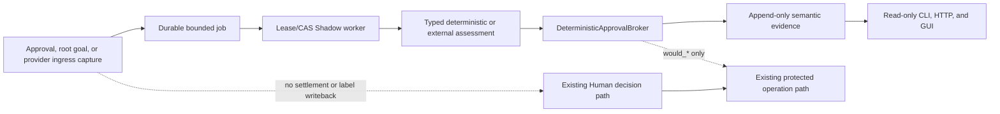

# Semantic Approval and Data Identification (Phase 0+1)

Agent libOS includes an opt-in semantic assessment plane for evaluating Human
approval requests and identifying potentially sensitive or low-integrity data.
This release is **Shadow-only**: it records `would_issue_exact_once`,
`would_deny`, or `require_human`, but it never answers, cancels, or settles a
Human request, issues or consumes a Capability, changes a permission policy,
updates `DataLabels`, creates a data-release approval, or changes a provider
result.

The semantic plane is evidence, not authority. The existing Capability, Task
Authority, Human, DataFlow, Protected Operation, provider-policy, state-version,
and resource-budget checks remain the only execution path.

## Release boundary

Phase 0+1 implements:

- a strict, Host-authored `semantic_auto_approval` Task Authority ceiling;
- a deterministic, pure Shadow broker and a closed action/effect ontology;
- typed semantic assessment and data-finding records;
- durable, lease/CAS-backed assessment jobs and an append-only assessment
  ledger in store schema v5;
- best-effort capture for eligible external-operation approval requests, root
  goals, and committed provider ingress observations;
- deterministic/scripted assessment and an optional, explicitly configured
  external classifier path;
- read-only CLI, HTTP, and GUI inspection surfaces.

It deliberately does **not** implement a machine settlement method, a semantic
HTTP write endpoint, automatic Capability issuance, deterministic real denial,
label writeback, declassification, endorsement, a complete FlowGraph,
field-level executable lineage, long-term memory, Cedar/OPA integration, or a
production rollout controller. Those require separate security review.

## Authority-neutral architecture



Capture, enqueue, classifier, observer, or evidence failures are isolated from
the business operation. A Human can approve or reject while assessment is in
flight. A late result records the observed Human outcome alongside the
historical Shadow decision; it does not overwrite that decision or reopen the
request. Post-commit result observers run only after the protected effect
transaction commits. Runtime composition binds the Host observer once; an
invocation-specific observer is additive and cannot replace or suppress it.
Each observer is isolated independently, so an observer failure does not
change the committed provider result or prevent the other observer from
running.

`mode: off` is the global kill switch and the default. In off mode capture
performs no semantic repository writes and workers do not claim jobs. Turning
an active runtime off stops new claims, cancels queued jobs, and records any
still-claimed ambiguous work as `provider_outcome_unknown`; every such terminal
job reduces its retained projection to hash-only evidence.

## Host-authored semantic ceiling

The optional Task Authority field is nested under `approval_policy`:

```json
{
  "semantic_auto_approval": {
    "schema_version": 1,
    "rules": [
      {
        "rule_id": "reports-read-v1",
        "authority_operation": "filesystem.read",
        "resource": "filesystem:workspace:reports/*",
        "rights": ["read"]
      }
    ]
  }
}
```

Absent, `null`, and an empty `rules` array all mean deny-all. Existing manifests
without this field retain their original canonical hash; the runtime does not
backfill a new field into them. Rules have a closed schema, unique bounded IDs,
one exact (non-wildcard) operation, a typed resource with at most one terminal
wildcard, and non-control rights. Unknown fields, wildcard operations, unsafe
or unsupported operations, data release, permission administration, and
control rights fail manifest admission.

The production ontology intentionally has only narrow, read-like candidate
operations. Filesystem read, Git read, and Git diff can be candidates when the
exact operation/resource/right tuple is covered. Shell, JSON-RPC, MCP, writes,
deletes, remote Git effects, and administration may still be assessed, but
cannot become auto-approval candidates in this phase.

Both parent and child must explicitly declare the ceiling. A child omission is
deny-all; a child rule must retain its parent's operation and narrow its
resource and rights. Ordinary Capabilities cannot create or widen the ceiling.
Checkpoint fork preserves the source ceiling for the remapped process but does
not widen it.

Candidate selection returns exact evidence for the concrete requested resource
and rights plus the matched rule, manifest, and policy digests. It is a
side-effect-free lookup, not a permit. It cannot create Human requests,
Capabilities, operations, events, or audit records.

## Decision contract

The classifier returns only closed, typed findings, calibration metadata, OOD,
and abstention. It has no `allow`, `deny`, free-form explanation, or hidden
reasoning field. A data finding contains a category, bounded field/span
locator, sensitivity floor, integrity/trust ceiling, confidence in basis
points, and an evidence digest. Findings are advisory and monotonic: they may
only suggest a higher sensitivity or a lower integrity/trust level. Phase 0+1
does not apply even those conservative suggestions to ambient
`DataFlowContext` or stored labels.

The deterministic broker is a pure function. Its precedence is:

1. a deterministic hard-policy violation produces `would_deny`;
2. malformed/stale/out-of-distribution input, abstention, classifier error, or
   any risk finding produces `require_human`;
3. `would_issue_exact_once` requires a matching Host ceiling and every
   authoritative positive predicate, including exact request binding, current
   manifest/policy/state, known eligible low-risk action, exact resource,
   a single non-control right, DataFlow clearance, and pinned classifier
   identity;
4. any missing positive predicate produces `require_human`.

Model findings may prevent a positive Shadow outcome. They cannot supply a
missing allow predicate, change the ontology, select a broader rule, or produce
a final permit.

## Captured inputs and privacy

Each job binds digests for the input, classifier artifact, feature snapshot,
policy, and applicable manifest/action/resource/arguments/state/source labels,
Sink, tool schema, provider specification, outbound projection, and any
Host-supplied tenant bucket digest. Provider ingress binds the real committed
result digest, effect ID, provider operation identity, and provider/source
identity. It does not invent a causal `operation_id` when the post-commit
observation has none. This release records findings about ingress but does not
write them back to the ambient label context.

Approval and provider-ingress capture are metadata-only and never set outbound
intent text. Root-goal capture may temporarily include a deterministic
`redacted_intent` in a queued or claimed job, but only when all of these checks
pass:

- the goal payload is a string or a mapping with an exact string `text` field;
- the normalized, non-empty text is no longer than `intent_max_chars`, whose
  hard maximum is 2,000 characters;
- the goal sensitivity is `public` or `normal` and its tenant/principal
  identity is not mixed;
- local secret/credential DLP and conservative absolute, relative, traversal,
  dot-directory, Windows-path, and URL-like path detection find no match; and
- the complete encoded projection remains within 16 KiB.

Control characters and whitespace are normalized deterministically before the
projection is stored. If any check fails, capture falls back to metadata-only;
it never sends a partially truncated secret or path. The assessment ledger and
terminal job retain no intent or source text. They also never retain a raw
path, argv, command, file/provider response body, prompt, raw classifier
response, credential, or model reasoning. A nonterminal job may hold only the
safe projection described above:

- the complete encoded projection is at most 16 KiB;
- any root-goal redacted intent is at most 2,000 characters;
- raw paths, argv, commands, bodies, credentials, and data above `normal`
  sensitivity are excluded; approval and provider ingress remain
  metadata-only;
- local DLP findings, mixed identity, or inability to prove the projection safe
  forces metadata-only assessment or skips the external call;
- the final projection is checked again by DataFlow before dispatch.

Local Host DLP evidence is independent of the external model. Projection code
scans any candidate redacted intent, while root capture separately scans the
exact Host-stored goal string or exact mapping `text` so an overlong secret
cannot evade detection by exceeding the intent bound. Provider ingress scans
text/bytes incrementally through the same exact built-in and Host-bound result
traversal used by streaming identity, capped at 500,000 nodes and 64 MiB. It
does not call provider-defined `__str__`, property, iterator, or serializer
hooks, and does not build a second aggregate plaintext copy. Approval capture
remains metadata-only and has no approval payload to scan.

At most four local detections are frozen in a job as only `category`, closed
reason code, and evidence digest. Any hit forces metadata-only projection and
removes redacted intent. Credential detectors become a Host-source,
10,000-basis-point `credential_material` finding with `high` severity and a
`secret` sensitivity floor. Path detectors become `business_secret` /
`sensitive_data`, `medium`, and `confidential`. The derived locator is
`root_goal`, `provider.result`, or `approval.request`; spans are null,
sensitivity uses the stricter of the existing label and floor, and integrity/
trust ceilings are never raised. These Host findings merge into every terminal
assessment path—including timeout, egress block, provider error, ambiguous
outcome, and schema failure—but remain advisory and never write labels back.

The Host post-commit boundary derives provider-result identity without invoking
arbitrary provider hooks. Its general safe canonical projection accepts only
bounded exact scalars, string-keyed mappings, lists/tuples, bytes, enums, and an
explicit Host allowlist of result dataclasses, with a 4,096-node and 256 KiB
budget. Filesystem, Shell, Git, JSON-RPC, and MCP contracts—and explicitly
Host-bound result dataclasses—may fall back to an incremental Host streaming
digest with a separate 500,000-node and 64 MiB ceiling. The streaming path
reads only exact built-in containers, Host-bound enum/dataclass storage, and
does not construct or persist a second aggregate plaintext value.

Both paths expose only a payload-free descriptor of at most 4 KiB containing
schema version, bounded type identity, `canonical_bounded |
digest_unavailable`, and canonical byte count. `result_type` names only an
exact built-in or a module-bound Host-allowlisted type; every other dynamic or
hostile type is reported as the fixed string `opaque`, so a class name cannot
become a disclosure channel. Opaque, cyclic, colliding-key, non-finite,
unsupported, or over-budget results produce `digest_unavailable`;
because provider-ingress capture requires a real result digest, that case
becomes an isolated capture failure rather than a fabricated identity. The
already committed provider result is still returned unchanged, and neither
the descriptor nor semantic persistence contains its original text or bytes.

The internal classifier operation is `semantic.llm.assess`, using the existing
`llm.complete` effect class and a Host-frozen profile/Sink identity. It sets the
Protected Operation no-release flag: a conditional DataFlow result becomes
`egress_blocked` and cannot recursively create `data_release_approval`. A
terminal, expired, cancelled, disabled, or failed job atomically reduces its
projection to `{}` with hash-only retention.

Semantic minimization applies only to the new semantic jobs and assessment
ledger. Other Agent libOS domains retain their own documented payload and
retention contracts; enabling Shadow does not retroactively make Human,
message, audit, event, or ordinary LLM rows payload-free.

## External classifier configuration

External assessment is optional. It must use a named, non-default LLM profile
selected by the Host. Enabling external Shadow rejects configuration unless
all of these profile properties are explicit and stable:

- a non-empty model;
- `store: false`;
- no prompt-cache key or retention;
- no previous-response chaining;
- `max_retries: 0`;
- a finite positive timeout.

The configuration/profile conditions are checked before an enabled external
Runtime is assembled. Assembly freezes both the selected profile snapshot
identity and its explicit model. At assessment time the adapter requires the
current snapshot identity and model to match those frozen values, requires
resolution to preserve that same identity, and validates the resolved client's
model and timeout. The Protected Operation separately binds
`llm:<profile-id>` and its Sink identity digest to the same frozen profile and
revalidates them before provider dispatch. External dispatch additionally
requires a low-level client that attests to exactly one transport attempt for
the job; that client condition is checked immediately before the Protected
Operation dispatch rather than inferred solely from configuration.

The adapter reuses profile resolution and structured-output support, not
`LLMProcessExecutor`, because the ordinary process executor can retain full
agent I/O. The classifier schema rejects unknown fields, duplicate JSON keys,
non-finite or out-of-range numbers, invalid enums, oversize findings, and
free-form response content. A timeout or failure is evidence only and cannot
increase authority. If the provider outcome is ambiguous, the terminal status
is `provider_outcome_unknown`; the durable worker never replays that external
request automatically.

Development and deterministic tests should use the scripted adapter. Real LLM
tests are opt-in integration smoke tests and are not a safety oracle.
An embedded Host must inject the scripted adapter through the Runtime
constructor's `semantic_assessor` dependency; enabled scripted Shadow fails
assembly without it. External and deterministic modes reject that replacement,
and no CLI, HTTP, GUI, model Tool, Skill, JIT, or Runtime Module can install an
assessor.

## Durable jobs and assessments

Store schema v5 adds mutable `semantic_assessment_jobs`, append-only
`semantic_assessments`, and `human_requests.revision`. Jobs use revision/status
CAS and a bounded lease. The external attempt counter is limited to zero or
one; lease recovery may recover a claim but cannot replay an already attempted
external request. Terminalization and assessment append share a transaction,
and terminal jobs are hash-only.

Runtime shutdown signals the worker pool and joins it for the bounded
`semantic.shutdown_join_timeout_s`. An incomplete join is reported through the
normal Runtime cleanup result; it does not authorize a replay or alter a Human
or provider result.

Assessment rows are immutable through the repository surface: there is append,
get, and bounded keyset query, but no update or delete method. The record holds
closed status/findings/Shadow fields and Host provenance digests rather than a
prompt or source payload. Checkpoint restore and fork do not copy, rewrite, or
delete this Host evidence ledger.

See [Runtime Storage](storage.md#offline-v4-to-v5-migration) for the only
supported v4-to-v5 migration workflow. Ordinary `Runtime.open()` never runs a
migration.

## Inspection surfaces

The CLI provides versioned JSON only:

```bash
uv run agent-libos --db .agent_libos.sqlite semantic status
uv run agent-libos --db .agent_libos.sqlite semantic assessments \
  --pid <pid> --domain filesystem --status success --limit 50
uv run agent-libos --db .agent_libos.sqlite semantic show <assessment_id>
```

Assessment lists accept `pid`, `request_id`, `operation_id`, `kind`, `status`,
`domain`, `action_id`, and `tenant_bucket_sha256` filters plus the opaque
`after` keyset cursor. `action_id` is a dotted lower-case ontology identifier;
the tenant bucket is an exact lower-case SHA-256 digest rather than a tenant
name. CLI and HTTP page sizes are 1 through 100, with a default of 50.

The authenticated local GUI server exposes only:

- `GET /api/semantic/status`;
- `GET /api/semantic/assessments`;
- `GET /api/semantic/assessments/{assessment_id}`.

Unknown, duplicate, empty, or overlong query parameters fail before the
service is called. There is no semantic `POST`, `PUT`, `PATCH`, or `DELETE`
route. The GUI Semantic tab reads those pages on demand, uses process scope as
a PID filter, and keeps semantic history out of the existing bounded Runtime
snapshot. Its strict decoder rejects unknown/private fields. It displays
reason codes, the normalized Human outcome, OOD/abstention, latency, Shadow
result, action/calibration, reserved nullable token/cost fields, and classifier/
policy/input/tenant provenance digests; it has no prompt, source-text,
response, projection, or reasoning expander. For a completed external
classifier dispatch, the producer may populate `input_tokens`, `output_tokens`,
and `cost_microunits` from strictly validated provider usage telemetry.
Deterministic/scripted assessments and missing, malformed, conflicting, or
untrusted counters remain `null`. Human outcome is one of
`pending`, `approved`, `rejected`, `edited`, `cancelled`, `delivered`, or
`null`; raw Human response content is never projected.

Telemetry accepts only exact non-negative integers no greater than JavaScript's
safe-integer maximum (`2^53 - 1`), selected from an exact Host `LLMCompletion`
and an exact built-in usage dictionary with at most 64 exact string keys.
`prompt_tokens` aliases `input_tokens`, and `completion_tokens` aliases
`output_tokens`; when a canonical key and alias are both present, they must be
valid and equal or that counter is discarded. Unknown keys and the raw usage
object are never copied into a job, assessment, effect, event, audit, CLI, API,
or GUI response. These values are provider-reported operational hints, not
proof of provider billing or classifier quality. The shared assessor keeps the
selected telemetry in worker-thread-local storage, clears stale state before a
new assessment, and lets the manager consume it once so concurrent jobs cannot
exchange counters.

Extraction occurs after an exact completion returns but before semantic
response/label validation, so valid counters can accompany an `invalid_schema`
terminal assessment. A transport exception, awaitable or non-exact completion,
non-exact usage dictionary, or absence of any valid known counter yields all
three fields as `null`. Telemetry never changes the assessment status, Shadow
outcome, or authority.

Status metrics keep Shadow and real execution separate. The status response is
schema v2. Alongside the scalar totals it carries complete, exact-key
`by_status` counters for every assessment status and `by_domain` counters for
every semantic domain. The former has exactly `success`, `skipped_policy`,
`egress_blocked`, `timeout`, `provider_error`, `provider_outcome_unknown`,
`invalid_schema`, `ood`, `abstained`, and `stale_input`; the latter has exactly
`filesystem`, `shell`, `git`, `jsonrpc`, `mcp`, `runtime`, and `unknown`. Both
maps must sum to `total`; `success + error` and the three Shadow outcomes must
also each sum to `total`, and scalar OOD must equal `by_status.ood`. CLI, HTTP,
and GUI decoders reject missing, extra, malformed, or inconsistent counters. In
this phase the real auto-approval object is
strictly `0 / 0 / null`; any other numerator, denominator, or rate is rejected,
and the CLI and GUI render `null` as not applicable, never as “0% unsafe.”
Assessment rows retain schema/status, reason, Human outcome, latency,
calibration, nullable token/cost fields, data-finding, domain/action, and
optional tenant-bucket evidence; list filters support domain, action, and an
existing tenant bucket. Token/cost values are available only on rows with
validated external telemetry and remain `null` otherwise; status does not sum
them into billing metrics. The v2 status response does not itself publish a
risk/tenant cube or an aggregate accuracy metric, and aggregate accuracy would
not be a safety conclusion.
Queue and assessment counts come from exact store aggregation; status does not
silently truncate older assessment rows. `capture_failures` is a runtime-local
health counter and resets on reopen; it is not an append-only assessment
record.

## Operational checklist

Before enabling Shadow for a tenant-scoped deployment or workload:

1. migrate an offline canonical v4 store to v5 and verify the v5 shape;
2. keep `mode: off` while validating configuration and scripted assessment;
3. if using an external adapter, register a dedicated non-default profile and
   confirm the frozen model/Sink/DataFlow contract;
4. query `semantic status` and confirm zero unexpected queue/capture failures;
5. enable only Shadow mode and verify Human, Capability, permission, label,
   release, process, and business-effect outcomes match the off baseline;
6. monitor segmented outcomes and secret-sentinel tests; turn the kill switch
   off on drift, leakage, OOD growth, or provider ambiguity.

`semantic.mode` is a global Runtime switch in this release. Agent libOS does
not provide an in-process per-tenant rollout controller; tenant scoping must be
established by the Host deployment. `tenant_bucket_sha256` is nullable and can
contain only an opaque lower-case digest produced by a trusted Host bucketer;
it is neither tenant plaintext nor, by itself, an anonymization guarantee. The
assembled Runtime defaults to `null`. An embedded Host may supply
`semantic_tenant_bucketer=` during Runtime construction; use a deployment-keyed
HMAC over a canonical tenant identifier and return its 64-character lower-case
SHA-256 encoding. The callback is a Host dependency only—there is no YAML,
CLI, HTTP, GUI, model, Skill, JIT, or Module mutation/installation entrypoint.
Without that callback Agent libOS performs no tenant grouping. A bucketer error
is a capture failure and cannot change the business operation.

Provider-side retention, abuse monitoring, billing, and deletion behavior
remain properties of the selected external service. `store: false` controls
the request contract supported by Agent libOS; it is not a blanket legal or
regulatory guarantee about the provider. PostgreSQL migration/CI, Windows CI,
and real-provider smoke results must be reported from the environment that ran
them rather than inferred from SQLite or scripted tests.
