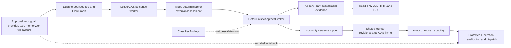

# Semantic Approval and Data Identification (Phase 0–4)

Agent libOS includes an opt-in semantic assessment and data-flow plane for
evaluating Human approval requests and identifying potentially sensitive or
low-integrity data. The default remains `semantic.mode: off`. Phase 2 adds a
payload-free FlowGraph, Phase 3 allows a closed set of deterministic hard
violations to reject a pending request, and Phase 4 can issue an exact,
short-lived, nondelegable, one-use Capability for a frozen low-risk action.

The classifier remains evidence, not authority: it may veto or escalate, but
it cannot supply an allow predicate, select a rule, decide a terminal status,
or mutate labels. Every machine settlement is produced by Host code after
live Task Authority, DataFlow, binding, epoch, state, and budget checks. The
normal Capability and Protected Operation path still owns provider dispatch.

## Release boundary

Agent libOS 1.5.1 implements:

- a strict, Host-authored `semantic_auto_approval` Task Authority ceiling;
- a deterministic, pure Shadow broker and a closed action/effect ontology;
- typed semantic assessment and data-finding records;
- durable, lease/CAS-backed assessment jobs and an append-only assessment
  ledger in store schema v7;
- best-effort capture for eligible external-operation approval requests, root
  goals, and committed provider ingress observations;
- deterministic/scripted assessment and an optional, explicitly configured
  external classifier path;
- append-only FlowGraph entity, activity, edge, and monotonic label-assertion
  evidence with explicit coverage;
- deterministic hard denial through a Host-only settlement boundary;
- canary-only exact-once issuance under an immutable static Host policy epoch;
- canonical approval previews and read-only CLI, HTTP, and GUI inspection.

It deliberately does **not** implement label writeback, declassification,
endorsement, high-risk/write/network auto approval, `always_allow`, long-term
memory, Cedar/OPA, a remote policy control plane, or automatic canary expansion.

## Authority architecture



Capture, enqueue, classifier, observer, or evidence failures never create
authority. A Human can approve or reject while assessment is in flight. Human,
cancel, machine deny, and canary auto approval share one request revision/status
CAS, so exactly one terminal transition wins. A late result records the
observed outcome and a race-lost/stale settlement; it cannot overwrite the
winner or reopen the request. Post-commit result observers run only after the protected effect
transaction commits. Runtime composition binds the Host observer once; an
invocation-specific observer is additive and cannot replace or suppress it.
Each observer is isolated independently, so an observer failure does not
change the committed provider result or prevent the other observer from
running.

`mode: off` is the global kill switch and the default. In off mode capture
performs no semantic repository writes and workers do not claim jobs. Turning
an active runtime off advances the durable control generation, stops new
settlements, invalidates every unconsumed or undispatched semantic grant at
authorization and dispatch revalidation, cancels queued jobs, and records any
still-claimed ambiguous classifier work as `provider_outcome_unknown`; every
such terminal job reduces its retained projection to hash-only evidence.

## Host-authored semantic ceiling

The optional Task Authority field is nested under `approval_policy`:

```json
{
  "semantic_auto_approval": {
    "schema_version": 1,
    "rules": [
      {
        "rule_id": "reports-read-v1",
        "authority_operation": "filesystem.read",
        "resource": "filesystem:workspace:reports/*",
        "rights": ["read"]
      }
    ]
  }
}
```

Absent, `null`, and an empty `rules` array all mean deny-all. Existing manifests
without this field retain their original canonical hash; the runtime does not
backfill a new field into them. Rules have a closed schema, unique bounded IDs,
one exact (non-wildcard) operation, a typed resource with at most one terminal
wildcard, and non-control rights. Unknown fields, wildcard operations, unsafe
or unsupported operations, data release, permission administration, and
control rights fail manifest admission.

Action catalog v1 is frozen to `filesystem.read`, `git.read`, and `git.diff`.
Those operations can be candidates only when the exact operation/resource/right
tuple is covered. Shell, JSON-RPC, MCP, writes, deletes, remote Git effects,
data release, permission/capability administration, and control rights may be
assessed but are structurally unreachable from automatic Capability issuance.
Adding another action requires a new catalog/policy epoch and a release; an
unknown action never inherits eligibility.

Both parent and child must explicitly declare the ceiling. A child omission is
deny-all; a child rule must retain its parent's operation and narrow its
resource and rights. Ordinary Capabilities cannot create or widen the ceiling.
Checkpoint fork preserves the source ceiling for the remapped process but does
not widen it.

Candidate selection returns exact evidence for the concrete requested resource
and rights plus the matched rule, manifest, and policy digests. It is a
side-effect-free lookup, not a permit. It cannot create Human requests,
Capabilities, operations, events, or audit records.

## Decision and enforcement contract

The classifier returns only closed, typed findings, calibration metadata, OOD,
and abstention. It has no `allow`, `deny`, free-form explanation, or hidden
reasoning field. A data finding contains a category, bounded field/span
locator, sensitivity floor, integrity/trust ceiling, confidence in basis
points, and an evidence digest. Findings are advisory and monotonic: they may
only suggest a higher sensitivity or a lower integrity/trust level. Phase 2–4
does not apply even those conservative suggestions to ambient
`DataFlowContext` or stored labels.

The deterministic broker is a pure function. Its precedence is:

1. a deterministic hard-policy violation produces `would_deny`;
2. malformed/stale/out-of-distribution input, abstention, classifier error, or
   any risk finding produces `require_human`;
3. `would_issue_exact_once` requires a matching Host ceiling and every
   authoritative positive predicate, including exact request binding, current
   manifest/policy/state, known eligible low-risk action, exact resource,
   a single non-control right, DataFlow clearance, and pinned classifier
   identity;
4. any missing positive predicate produces `require_human`.

Model findings may prevent a positive Shadow outcome. They cannot supply a
missing allow predicate, change the ontology, select a broader rule, or produce
a final permit or denial. Real enforcement uses a second Host-owned pure broker
and a closed result type; model output is never a safety oracle.

The four modes have intentionally different authority:

| Mode | Capture/evidence | Machine denial | Machine approval |
| --- | --- | --- | --- |
| `off` | none | none | none |
| `shadow` | assessment and FlowGraph evidence | none (`would_deny` only) | none (`would_issue_exact_once` only) |
| `enforce_deny` | yes | closed Host hard-deny set only | none |
| `canary_auto` | yes | closed Host hard-deny set only | exact one-use grant when every Host predicate holds |

A real hard denial is limited to a malformed/incomplete exact operation
request, request/effect/subject/resource/right binding mismatch, stale target
state/manifest/policy epoch, an explicit DataFlow denial, or an exact Host
hard-deny rule. Ceiling misses, unsupported/high-risk operations, incomplete
FlowGraph coverage, OOD, abstention, low confidence, timeouts, classifier
errors, and every model finding remain pending for Human review.

Before applying a Human approval in `enforce_deny` or `canary_auto`, the same
live hard-deny preflight runs inside the terminal transaction. A newly observed
hard violation produces a `semantic_policy_response` event and independent
policy audit actor; it never impersonates `human_response`. Retrying the
operation creates a new request/effect/binding rather than rewriting the
terminal request.

External-operation presentation is generated from Host facts as
`CanonicalApprovalPreviewV1`, not from model explanation text. It binds the
request revision, action, exact resource/right, risk, source/sink identities,
labels, reason codes, TTL, and applicable epoch into `preview_sha256`. In
`enforce_deny` and `canary_auto`, a GUI/CLI/terminal Human response must return
the exact `expected_revision` and `preview_sha256`; a missing, stale, malformed,
or mismatched preview is rejected before any terminal side effect. The preview
is evidence for what was shown, not an allow predicate.

## FlowGraph and monotonic data findings

Store schema v7 records content-free flow entities for root goals,
Object/file versions, provider and Tool results, materializations, and model
outputs, plus activities for Process, provider, Tool, LLM, Object, and file
operations. Edges use the closed `direct`, `indirect`, or `control` relation.
Every record contains bounded IDs, versions, hashes, labels, identity state,
coverage, and Host provenance; it contains no body, path, argv, prompt,
response, credential, or reasoning.

JSON field and text-chunk locators are digest-only prototypes. A locator may
identify a bounded JSON path/value digest or text chunk ordinal/offset/digest;
it cannot recover source text. Host edges are append-only. A model assertion
may only raise the effective sensitivity floor or lower integrity/trust. It
cannot remove an edge, weaken a label, endorse, declassify, or write ambient
`DataLabels`.

Coverage is one of `complete`, `partial`, `unknown`, `conflict`, or `stale`.
Only `complete` coverage for one non-mixed tenant identity can satisfy a
canary allow predicate. Historical v5 activity and every capture failure are
`unknown`, never inferred safe from the absence of an edge. Filesystem reads
also require a current file binding/content version; Git reads and diffs require
the frozen local repository/ref/state identity.

Git canary eligibility uses one explicit pre-intent provider exception:
Host-only `GitPrimitive._semantic_read_flow_snapshot` may inspect local
repository layout/state and run checker-reviewed read-only Git commands before
authority exists to enter the ordinary Protected Operation. It returns only
bounded digests plus DataFlow label/source-reference metadata, creates no
durable external-effect intent of its own, and cannot perform remote or mutating
work. The static checker pins the exact owner/root call graph and read-only
runner shape. If the grant is later used, the ordinary Git read creates its
protected intent and repeats the flow/state observation before returning
payload; the preflight is not evidence of a protected dispatch.

## Policy epoch and exact-once settlement

An active canary epoch is an immutable, digest-bound static Host policy using
catalog v1. `canary_auto` requires the external adapter and a dedicated
non-default safe classifier profile; the epoch pins that exact profile and
model digest. The Host configuration must name an exact non-empty tenant bucket
allowlist, the eligible rule set, expected previous policy digest, and control
generation. There is no wildcard tenant, implicit epoch, auto-activation,
in-process expansion, or remote policy mutation. Conflicting activation state
fails Runtime assembly closed.

The Host-only settlement port re-reads the pending request, revision, Process,
Task Authority ceiling, DataFlow/FlowGraph state, epoch, tenant, action,
provider/tool/Sink/state identities, classifier provenance, and budget inside
the same transaction. It may issue only when the classifier result is valid,
contains no finding/OOD/abstention/error, has at least 9,900 confidence basis
points with `very_high` calibration, and every independent Host allow predicate
is already true. Classifier confidence is a veto threshold, not proof of safety.

Issuance atomically settles the assessment job, appends assessment and
settlement evidence, CASes the request, transitions the Process, emits policy
event/audit evidence, debits the rate budget, and creates one revocable,
nondelegable Capability with `uses_remaining=1`. Its default TTL is 60 seconds
and hard maximum is 300 seconds. The v1 upper bounds are 10 grants per minute,
100 per day, and 2 inflight for each tenant/rule; an epoch can only narrow them.
The machine path never installs `always_allow`.

The approval binding includes request/revision, effect/action/resource/right,
canonical arguments and target state, manifest/ceiling/policy epoch,
assessment/classifier, tenant/source labels, Sink/tool/provider identities,
nonce, issuance time, and deadline. Protected Operation rechecks that binding
and the durable control generation during authorization, reservation, prepare,
and before each provider dispatch. Certified `not_started` can restore the same
approved reservation; an unknown provider outcome consumes authority, forbids
automatic replay, and trips the active epoch.

## Captured inputs and privacy

Each job binds digests for the input, classifier artifact, feature snapshot,
policy, and applicable manifest/action/resource/arguments/state/source labels,
Sink, tool schema, provider specification, outbound projection, and any
Host-supplied tenant bucket digest. Provider ingress binds the real committed
result digest, effect ID, provider operation identity, and provider/source
identity. It does not invent a causal `operation_id` when the post-commit
observation has none. This release records findings about ingress but does not
write them back to the ambient label context.

Approval and provider-ingress capture are metadata-only and never set outbound
intent text. Root-goal capture may temporarily include a deterministic
`redacted_intent` in a queued or claimed job, but only when all of these checks
pass:

- the goal payload is a string or a mapping with an exact string `text` field;
- the normalized, non-empty text is no longer than `intent_max_chars`, whose
  hard maximum is 2,000 characters;
- the goal sensitivity is `public` or `normal` and its tenant/principal
  identity is not mixed;
- local secret/credential DLP and conservative absolute, relative, traversal,
  dot-directory, Windows-path, and URL-like path detection find no match; and
- the complete encoded projection remains within 16 KiB.

Control characters and whitespace are normalized deterministically before the
projection is stored. If any check fails, capture falls back to metadata-only;
it never sends a partially truncated secret or path. The assessment ledger and
terminal job retain no intent or source text. They also never retain a raw
path, argv, command, file/provider response body, prompt, raw classifier
response, credential, or model reasoning. A nonterminal job may hold only the
safe projection described above:

- the complete encoded projection is at most 16 KiB;
- any root-goal redacted intent is at most 2,000 characters;
- raw paths, argv, commands, bodies, credentials, and data above `normal`
  sensitivity are excluded; approval and provider ingress remain
  metadata-only;
- local DLP findings, mixed identity, or inability to prove the projection safe
  forces metadata-only assessment or skips the external call;
- the final projection is checked again by DataFlow before dispatch.

Local Host DLP evidence is independent of the external model. Projection code
scans any candidate redacted intent, while root capture separately scans the
exact Host-stored goal string or exact mapping `text` so an overlong secret
cannot evade detection by exceeding the intent bound. Provider ingress scans
text/bytes incrementally through the same exact built-in and Host-bound result
traversal used by streaming identity, capped at 500,000 nodes and 64 MiB. It
does not call provider-defined `__str__`, property, iterator, or serializer
hooks, and does not build a second aggregate plaintext copy. Approval capture
remains metadata-only and has no approval payload to scan.

At most four local detections are frozen in a job as only `category`, closed
reason code, and evidence digest. Any hit forces metadata-only projection and
removes redacted intent. Credential detectors become a Host-source,
10,000-basis-point `credential_material` finding with `high` severity and a
`secret` sensitivity floor. Path detectors become `business_secret` /
`sensitive_data`, `medium`, and `confidential`. The derived locator is
`root_goal`, `provider.result`, or `approval.request`; spans are null,
sensitivity uses the stricter of the existing label and floor, and integrity/
trust ceilings are never raised. These Host findings merge into every terminal
assessment path—including timeout, egress block, provider error, ambiguous
outcome, and schema failure—but remain advisory and never write labels back.

The Host post-commit boundary derives provider-result identity without invoking
arbitrary provider hooks. Its general safe canonical projection accepts only
exact `None`, `bool`, `int`, finite `float`, `str`, `bytes`, and `bytearray`
values; `StrEnum` values; exact `list`/`tuple` containers; exact `dict`
containers with exact string keys; and an explicit Host allowlist of result
dataclasses, with a 4,096-node and 256 KiB budget. Arbitrary `Enum` values are
not accepted. Filesystem, Shell, Git, JSON-RPC, MCP, and LLM contracts—and
explicitly Host-bound result dataclasses—may use an incremental Host streaming
digest with a separate 500,000-node and 64 MiB ceiling. The streaming path
accepts the same exact built-in values, but enums must be Host-owned,
module-bound, and string-valued, and dataclasses must be Host-bound and
allowlisted. It does not construct or persist a second aggregate plaintext
value.

For the allowlisted `LLMCompletion`, identity and local text traversal include
only normalized fields consumed by the Runtime. Raw provider objects, hidden
reasoning, provider request options, compatibility-removal metadata, provider
trace, and provider-attempt sequence state are excluded; Semantic ingress does
not claim to classify or bind those opaque fields.

Both paths expose only a payload-free descriptor of at most 4 KiB containing
schema version, bounded type identity, `canonical_bounded |
digest_unavailable`, and canonical byte count. `result_type` names only an
exact built-in or a module-bound Host-allowlisted type; every other dynamic or
hostile type is reported as the fixed string `opaque`, so a class name cannot
become a disclosure channel. Opaque, cyclic, colliding-key, non-finite,
unsupported, or over-budget results produce `digest_unavailable`;
because provider-ingress capture requires a real result digest, that case
becomes an isolated capture failure rather than a fabricated identity. The
already committed provider result is still returned unchanged, and neither
the descriptor nor semantic persistence contains its original text or bytes.

The internal classifier operation is `semantic.llm.assess`, using the existing
`llm.complete` effect class and a Host-frozen profile/Sink identity. It sets the
Protected Operation no-release flag: a conditional DataFlow result becomes
`egress_blocked` and cannot recursively create `data_release_approval`. A
terminal, expired, cancelled, disabled, or failed job atomically reduces its
projection to `{}` with hash-only retention.

Semantic minimization applies only to the new semantic jobs and assessment
ledger. Other Agent libOS domains retain their own documented payload and
retention contracts; enabling Shadow does not retroactively make Human,
message, audit, event, or ordinary LLM rows payload-free.

## External classifier configuration

External assessment is optional. It must use a named, non-default LLM profile
selected by the Host. Enabling any external semantic mode rejects configuration unless
all of these profile properties are explicit and stable:

- a non-empty model;
- `store: false`;
- no prompt-cache key or retention;
- no previous-response chaining;
- `max_retries: 0`;
- a finite positive timeout.

The configuration/profile conditions are checked before an enabled external
Runtime is assembled. Assembly freezes both the selected profile snapshot
identity and its explicit model. At assessment time the adapter requires the
current snapshot identity and model to match those frozen values, requires
resolution to preserve that same identity, and validates the resolved client's
model and timeout. The Protected Operation separately binds
`llm:<profile-id>` and its Sink identity digest to the same frozen profile and
revalidates them before provider dispatch. External dispatch additionally
requires a low-level client that attests to exactly one transport attempt for
the job; that client condition is checked immediately before the Protected
Operation dispatch rather than inferred solely from configuration.

The adapter reuses profile resolution and structured-output support, not
`LLMProcessExecutor`, because the ordinary process executor can retain full
agent I/O. The classifier schema rejects unknown fields, duplicate JSON keys,
non-finite or out-of-range numbers, invalid enums, oversize findings, and
free-form response content. A timeout or failure is evidence only and cannot
increase authority. If the provider outcome is ambiguous, the terminal status
is `provider_outcome_unknown`; the durable worker never replays that external
request automatically.

Development and deterministic tests should use the scripted adapter. Real LLM
tests are opt-in integration smoke tests and are not a safety oracle.
An embedded Host must inject the scripted adapter through the Runtime
constructor's `semantic_assessor` dependency; an enabled scripted semantic mode fails
assembly without it. External and deterministic modes reject that replacement,
and no CLI, HTTP, GUI, model Tool, Skill, JIT, or Runtime Module can install an
assessor.

## Durable jobs, graph, and settlement evidence

Store schema v5 introduced mutable `semantic_assessment_jobs`, append-only
`semantic_assessments`, and `human_requests.revision`. Store schema v6 adds
append-only FlowGraph, immutable policy epochs, a revisioned control pointer
and rate buckets, plus append-only machine settlement, health/trip, Human
outcome-link, and review evidence. Jobs use revision/status
CAS and a bounded lease. The external attempt counter is limited to zero or
one; lease recovery may recover a claim but cannot replay an already attempted
external request. Terminalization and assessment append share a transaction,
and terminal jobs are hash-only.

Runtime shutdown signals the worker pool and joins it for the bounded
`semantic.shutdown_join_timeout_s`. An incomplete join is reported through the
normal Runtime cleanup result; it does not authorize a replay or alter a Human
or provider result.

Assessment, FlowGraph history, policy epochs, settlement, health, and review
rows are immutable through the repository surface: there is append,
get, and bounded keyset query, but no update or delete method. The record holds
closed status/findings/Shadow fields and Host provenance digests rather than a
prompt or source payload. Checkpoint restore and fork do not copy, rewrite, or
delete this Host evidence ledger.

See [Runtime Storage](storage.md) for the ordered offline v4-to-v5, v5-to-v6,
and v6-to-v7 migration workflows. Ordinary `Runtime.open()` never runs a
migration.

## Inspection surfaces

The CLI emits versioned JSON. Runtime inspection is read-only; the sole write
surface is an offline Host-only review-evidence append, which cannot alter an
epoch, control state, request, Capability, label, or provider operation:

```bash
uv run agent-libos --db .agent_libos.sqlite semantic status
uv run agent-libos --db .agent_libos.sqlite semantic assessments \
  --pid <pid> --domain filesystem --status success --limit 50
uv run agent-libos --db .agent_libos.sqlite semantic show <assessment_id>
uv run agent-libos --db .agent_libos.sqlite semantic flow status
uv run agent-libos --db .agent_libos.sqlite semantic flow entities --limit 50
uv run agent-libos --db .agent_libos.sqlite semantic flow edges --limit 50
uv run agent-libos --db .agent_libos.sqlite semantic flow lineage <node_id>
uv run agent-libos --db .agent_libos.sqlite semantic settlements --limit 50
uv run agent-libos --db .agent_libos.sqlite semantic policy epochs --limit 50
uv run agent-libos --db .agent_libos.sqlite semantic control status
uv run agent-libos --db .agent_libos.sqlite semantic control history --limit 50
uv run agent-libos --db .agent_libos.sqlite semantic health --limit 50
uv run agent-libos --db .agent_libos.sqlite semantic metrics
uv run agent-libos --db .agent_libos.sqlite semantic review import \
  --file <strict-json-review-evidence>
```

Assessment lists accept `pid`, `request_id`, `operation_id`, `kind`, `status`,
`domain`, `action_id`, and `tenant_bucket_sha256` filters plus the opaque
`after` keyset cursor. `action_id` is a dotted lower-case ontology identifier;
the tenant bucket is an exact lower-case SHA-256 digest rather than a tenant
name. CLI and HTTP page sizes are 1 through 100, with a default of 50.

The authenticated local GUI server exposes only:

- `GET /api/semantic/status`;
- `GET /api/semantic/assessments`;
- `GET /api/semantic/assessments/{assessment_id}`;
- `GET /api/semantic/flow/status`;
- `GET /api/semantic/flow/entities`;
- `GET /api/semantic/flow/edges`;
- `GET /api/semantic/flow/lineage/{node_id}`;
- `GET /api/semantic/settlements`;
- `GET /api/semantic/policy/epochs`;
- `GET /api/semantic/control` and `/api/semantic/control/history`;
- `GET /api/semantic/health`;
- `GET /api/semantic/metrics`.

Unknown, duplicate, empty, or overlong query parameters fail before the
service is called. There is no semantic `POST`, `PUT`, `PATCH`, or `DELETE`
route, and no route can import reviews or mutate policy/control. The GUI
Semantic tab reads those pages on demand, uses process scope as
a PID filter, and keeps semantic history out of the existing bounded Runtime
snapshot. Its strict decoder rejects unknown/private fields. It displays
reason codes, the normalized Human outcome, OOD/abstention, latency, Shadow
result, action/calibration, reserved nullable token/cost fields, and classifier/
policy/input/tenant provenance digests; it has no prompt, source-text,
response, projection, or reasoning expander. For a completed external
classifier dispatch, the producer may populate `input_tokens`, `output_tokens`,
and `cost_microunits` from strictly validated provider usage telemetry.
Deterministic/scripted assessments and missing, malformed, conflicting, or
untrusted counters remain `null`. Human outcome is one of
`pending`, `approved`, `rejected`, `edited`, `cancelled`, `delivered`, or
`null`; raw Human response content is never projected.

Telemetry accepts only exact non-negative integers no greater than JavaScript's
safe-integer maximum (`2^53 - 1`), selected from an exact Host `LLMCompletion`
and an exact built-in usage dictionary with at most 64 exact string keys.
`prompt_tokens` aliases `input_tokens`, and `completion_tokens` aliases
`output_tokens`; when a canonical key and alias are both present, they must be
valid and equal or that counter is discarded. Unknown keys and the raw usage
object are never copied into a job, assessment, effect, event, audit, CLI, API,
or GUI response. These values are provider-reported operational hints, not
proof of provider billing or classifier quality. The shared assessor keeps the
selected telemetry in worker-thread-local storage, clears stale state before a
new assessment, and lets the manager consume it once so concurrent jobs cannot
exchange counters.

Extraction occurs after an exact completion returns but before semantic
response/label validation, so valid counters can accompany an `invalid_schema`
terminal assessment. A transport exception, awaitable or non-exact completion,
non-exact usage dictionary, or absence of any valid known counter yields all
three fields as `null`. Telemetry never changes the assessment status, Shadow
outcome, or authority.

Status metrics keep Shadow and real execution separate. The status response is
schema v3. Alongside the scalar totals it carries complete, exact-key
`by_status` counters for every assessment status and `by_domain` counters for
every semantic domain. The former has exactly `success`, `skipped_policy`,
`egress_blocked`, `timeout`, `provider_error`, `provider_outcome_unknown`,
`invalid_schema`, `ood`, `abstained`, and `stale_input`; the latter has exactly
`filesystem`, `shell`, `git`, `jsonrpc`, `mcp`, `runtime`, and `unknown`. Both
maps must sum to `total`; `success + error` and the three Shadow outcomes must
also each sum to `total`, and scalar OOD must equal `by_status.ood`. CLI, HTTP,
and GUI decoders reject missing, extra, malformed, or inconsistent counters.
Real machine counters distinguish eligible, issued, consumed, succeeded,
failed, unknown, expired, revoked, race-lost, and deterministic denied. Public
control state is `inactive`, `active`, `tripped`, or `revoked`, with an exact
generation and optional active epoch/trip reason. The status embeds typed
FlowGraph counts/coverage while the Flow endpoints provide bounded records.
A rate whose denominator is
zero is `null`, and the CLI and GUI render it as not applicable, never as “0%
unsafe.” The unsafe-review rate uses the Host-reviewed count as its denominator;
without any reviewed settlement it is `null`.
Assessment rows retain schema/status, reason, Human outcome, latency,
calibration, nullable token/cost fields, data-finding, domain/action, and
optional tenant-bucket evidence; list filters support domain, action, and an
existing tenant bucket. Token/cost values are available only on rows with
validated external telemetry and remain `null` otherwise; status does not sum
them into billing metrics. Metrics are segmented by action, tenant bucket,
risk, and policy epoch. No aggregate accuracy value is treated as a safety
conclusion.
Queue and assessment counts come from exact store aggregation; status does not
silently truncate older assessment rows. `capture_failures` is a runtime-local
health counter and resets on reopen; it is not an append-only assessment
record.

## Operational checklist

Before enabling any semantic mode for a tenant-scoped deployment or workload:

1. migrate an offline canonical v4 store to v5, then v5 to v6, then v6 to v7,
   and verify the complete v7 shape;
2. keep `mode: off` while validating configuration and scripted assessment;
3. if using an external adapter, register a dedicated non-default profile and
   confirm the frozen model/Sink/DataFlow contract;
4. query `semantic status` and confirm zero unexpected queue/capture failures;
5. enable only Shadow mode and verify Human, Capability, permission, label,
   release, process, and business-effect outcomes match the off baseline;
6. activate a new immutable static Host epoch for one exact tenant bucket
   before `enforce_deny` or `canary_auto`; never reuse or revive an old epoch;
7. keep each action/epoch canary for at least seven days and review the first
   1,000 issued grants at 100% coverage before a new epoch expands the cohort;
8. monitor segmented outcomes and secret-sentinel tests; turn the kill switch
   off on drift, leakage, OOD growth, or provider ambiguity.

`semantic.mode` is a global Runtime switch in this release. Epochs and exact
tenant buckets are supplied by immutable static Host configuration. Agent libOS
does not provide a remote or in-process rollout controller; cohort expansion
requires a new policy epoch and restart. `tenant_bucket_sha256` is nullable and can
contain only an opaque lower-case digest produced by a trusted Host bucketer;
it is neither tenant plaintext nor, by itself, an anonymization guarantee. The
assembled Runtime defaults to `null`. An embedded Host may supply
`semantic_tenant_bucketer=` during Runtime construction; use a deployment-keyed
HMAC over a canonical tenant identifier and return its 64-character lower-case
SHA-256 encoding. The callback is a Host dependency only—there is no YAML,
CLI, HTTP, GUI, model, Skill, JIT, or Module mutation/installation entrypoint.
Without that callback Agent libOS performs no tenant grouping and cannot enter
`canary_auto`. A bucketer error is a capture failure and cannot create
authority.

Runtime admission enforces rollout as a fail-closed ratchet. A strict
tenant/rule/resource narrowing may rotate immediately. Any same-size tenant
swap, cohort addition, or rule/resource widening must be proven against the
preceding immutable epoch for every affected action: its durable activation
transition is at least seven days old, at least 1,000 distinct grants were
issued, the earliest 1,000 have only complete `safe` review evidence, and no
issued grant in that epoch/action has an `unsafe` review. Policy `created_at`
does not satisfy the age check because static configuration can be backdated.

An unsafe review, critical/high machine grant, cross-tenant grant, secret
egress, replay, binding mismatch, unauthorized effect, or unknown provider
outcome trips the current epoch. A trip blocks new settlements and invalidates
unconsumed/undispatched grants through the durable control-generation check.
It never claims to roll back an already dispatched external effect.

Provider-side retention, abuse monitoring, billing, and deletion behavior
remain properties of the selected external service. `store: false` controls
the request contract supported by Agent libOS; it is not a blanket legal or
regulatory guarantee about the provider. PostgreSQL migration/CI, Windows CI,
and real-provider smoke results must be reported from the environment that ran
them rather than inferred from SQLite or scripted tests.
